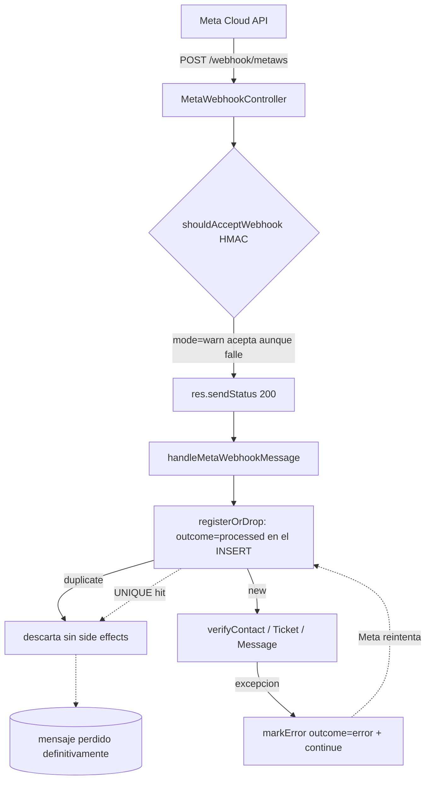

# Auditoría backend-canales — chateam_jr

**Fecha:** 2026-07-23 · **Modo:** READ-ONLY (sin builds, sin escrituras a código/BD/PM2)
**Dominio:** Canales e integraciones — WhatsApp Cloud API (Meta), Baileys, Telegram, Facebook/Instagram (Messenger + comentarios), TikTok, WebChat, Email marketing (SendGrid/Mailgun/Carbonio/Listmonk), Meta CAPI, coexistencia.

---

## 1. Alcance revisado

| Área | Artefactos revisados |
|---|---|
| Webhooks entrantes | `routes/webHookRoutes.ts`, `controllers/WebHookController.ts`, `controllers/MetaWebhookController.ts`, `controllers/FBPageWebhookController.ts`, `controllers/TelegramController.ts`, `controllers/EmailWebhookController.ts`, `controllers/IntegrationController.ts` |
| Firma / anti-replay | `services/CoexistenceServices/MetaSignatureValidator.ts`, `app.ts` (captura `rawBody`) |
| Idempotencia / dedupe | `services/CoexistenceServices/InboundEventLedgerService.ts`, `models/InboundEventLedger.ts`, migración `20260421000001`, índices reales en Postgres |
| Listeners de canal | `services/MetaServices/metaMessageListener.ts` (2.264 líneas), `services/WbotServices/wbotMessageListener.ts`, `services/FacebookServices/facebookMessageListener.ts`, `services/TelegramService/TelegramMessageListener.ts`, `services/SocialCommentServices/{IngestCommentService,extractCommentEvents}.ts` |
| Egress / terceros | `services/MetaServices/{metaClient,metaSendService}.ts`, `services/CoexistenceServices/{OutboundDispatchService,OutboundAdapters,OutboundRoutingService}.ts`, `services/CircuitBreakerService.ts`, `services/EmailMarketing/providers/ListmonkProvider.ts`, `services/FacebookConversionService/*` |
| Secretos de canal | `models/Whatsapp.ts`, `helpers/secretCrypto.ts`, `services/WhatsappService/{ShowWhatsAppService,ShowWhatsAppServiceAdmin,ListWhatsAppsService}.ts`, `services/MetaServices/MetaTokenRefreshService.ts`, `services/TikTokService/*` |
| Sesiones Baileys | `helpers/useMultiFileAuthState.ts`, `libs/wbot.ts`, `services/BaileysServices/CreateOrUpdateBaileysService.ts` |
| WebChat | `routes/webChatWidgetRoutes.ts`, `controllers/WebChatWidgetController.ts`, `services/WebChatWidgetServices/WebChatConversationService.ts` |
| Coexistencia | `services/CoexistenceServices/*`, `scheduler/MetaCoexistenceScheduler.ts`, `services/MetaServices/metaSmb*`, `metaHistorySyncService.ts` |
| Runtime | `ecosystem.config.cjs`, `pm2 jlist`, `/proc/3948697/environ`, `logs/app-*.log.gz`, Postgres `chateamjr` |

**Fuera de alcance:** frontend de conexiones (salvo cuando confirma consumo de un secreto), pagos (Stripe/PayPal/Coingate/MercadoPago), UGC/Higgsfield/Fal salvo por el patrón de firma, módulo IA.

## 2. Método

1. Partí de `audit/_data/endpoints.tsv` (891 endpoints) filtrando por canal/webhook para levantar el mapa de superficie pública sin recalcular.
2. Lectura directa del código de cada handler de webhook, siguiendo la cadena controller → listener → persistencia.
3. Verificación en Postgres (solo `SELECT` / `\d`) sobre `InboundEventLedger`, `Whatsapps`, `Baileys`, `ApiFailedMessages`, `Messages` para contrastar el diseño contra el estado real de producción.
4. Verificación del runtime: `pm2 jlist`, `/proc/<pid>/environ` del proceso `chateam-node` (PID 3948697), logs rotados.
5. Contraste doc↔código contra `docs/_consolidado/**` para detectar afirmaciones de "hecho" que el código no sostiene.

**Limitación declarada:** `.env` está bloqueado por hook de seguridad. Los flags que se leen por `dotenv` en runtime (`META_SIGNATURE_MODE`, `COEX_UNIFIED_DISPATCH`, `FACEBOOK_APP_SECRET`, `REDIS_*`) **no aparecen** en `/proc/3948697/environ`, pero `app.ts:39` ejecuta `dotenvConfig()`, por lo que podrían estar definidos en `.env`. Donde esto afecta a un hallazgo lo indico explícitamente.

---

## 3. Mapa de superficie pública de canales

| Canal | Endpoint | Auth | Firma/secreto | Dedupe | Rate limit |
|---|---|---|---|---|---|
| Messenger + Instagram DM + comentarios | `POST /webhook/` | NO | **ninguna** | parcial (comentarios sí, DMs no) | NO |
| Verificación Messenger | `GET /webhook/` | NO | `VERIFY_TOKEN` (default `whaticket`) | n/a | NO |
| WhatsApp Cloud API + templates + comentarios | `POST /webhook/metaws` | NO | HMAC `X-Hub-Signature-256` en modo `warn` | sí (`InboundEventLedger`) | NO |
| Verificación WhatsApp Cloud | `GET /webhook/metaws` | NO | `VERIFY_TOKEN` global + `tokenMeta` por conexión | n/a | NO |
| Comentarios FB Pages | `POST /webhook/facebook` | NO | HMAC declarado pero **inoperante** (sin `rawBody`) | sí, vía `WebhookCommentProcessor` | NO |
| Telegram | `POST /telegram/webhook/:telegramId` | NO | **ninguna** (sin `secret_token`) | **no** | NO |
| TikTok OAuth | `GET /tiktok/oauth/callback` | NO | `state` generado pero **no validado** | n/a | NO |
| WebChat widget | `GET /webchat/public/config/:apiKey`, `POST /webchat/public/message`, `GET /webchat/public/messages/:apiKey/:sessionId` | NO | `apiKey` + Origin/Referer (opcional) | no | NO |
| Email (SendGrid/Mailgun/Carbonio) | `POST /webhooks/email/{sendgrid,mailgun,carbonio}` | NO | **ninguna** | no | NO |
| Integraciones genéricas | `POST /integrations/webhooks/:providerId` | NO | HMAC por conexión (`verifyWebhookSignature`) | vía `IntegrationWebhookEvent` | NO |

Fuentes: `routes/webHookRoutes.ts:9-18`, `routes/telegramRoutes.ts:15`, `routes/tiktokRoutes.ts:11`, `routes/webChatWidgetRoutes.ts:25-27`, `routes/emailTrackingRoutes.ts:51-66`, `routes/integrationRoutes.ts:61`.

## 4. Estado real del ledger de eventos (producción)

`select provider, outcome, count(*) from "InboundEventLedger" group by 1,2 order by 3 desc;`

| provider | outcome | filas |
|---|---|---|
| baileys_fromme | processed | 34.379 |
| baileys | processed | 24.481 |
| meta | processed | 8.468 |
| meta_echo | processed | 7.678 |
| meta | dropped | 1.725 |
| **meta** | **error** | **740** |
| **meta_echo** | **error** | **13** |
| meta_comment | processed | 10 |

Total 77.494 filas · rango `2026-04-21` → `2026-07-22` · 43 MB · sin política de retención.
Los 753 `error` tienen **`messageId IS NULL` en el 100 % de los casos** (753/753): son mensajes entrantes que nunca se persistieron.

Índice de idempotencia confirmado: `idx_inbound_event_ledger_company_eventkey_unique UNIQUE ("companyId","eventKey")`.

Flujo inbound Meta:

---

## 5. Hallazgos

### HALLAZGO C-01 — Webhook Messenger/Instagram sin ninguna validación de origen
**Severidad:** CRITICO · **Confianza:** ALTA · **Esfuerzo:** 0,5 d

**Descripción.** `POST /webhook/` recibe la mensajería de Facebook Messenger e Instagram Direct y la ingesta de comentarios FB/IG. No valida `X-Hub-Signature-256`, no exige auth, no consulta el ledger de idempotencia y resuelve el tenant únicamente por `entry.id` (id de página), un dato público. `app.ts:113-128` sólo captura `rawBody` para `/stripewebhook`, `/api/fal/webhook`, `/webhook/meta`, `/webhook/metaws`, `/webhooks/meta`, `/webhooks/metaws` — `"/webhook/"` no coincide con ninguna, así que ni siquiera existe el material para validar una firma.

**Evidencia.**
- `routes/webHookRoutes.ts:10` — `webHooksRoutes.post("/", WebHooksController.webHook);` (sin `isAuth`, sin validador)
- `controllers/WebHookController.ts:29-91` — entra directo a `extractCommentEvents(body)` y `handleMessage(getTokenPage, data, channel, getTokenPage.companyId)`
- `controllers/WebHookController.ts:79-84` — `Whatsapp.findOne({ where: { facebookPageUserId: entry.id, channel } })` es la única "autenticación"
- `app.ts:117-124` — lista de URLs con `rawBody`; no incluye `/webhook/`
- Contraste: `controllers/MetaWebhookController.ts:60-72` sí invoca el validador en el endpoint hermano

**Riesgo.** Un tercero que conozca el Page ID (público) inyecta mensajes entrantes arbitrarios en el inbox de cualquier tenant, crea contactos/tickets, dispara flujos de chatbot e IA (con coste por token) y contamina atribución/CAPI. Sin rate limit, además, es un vector de DoS.

**Recomendación.** Añadir `/webhook` y `/webhook/facebook` a la lista de `rawBody` en `app.ts:117-124` y aplicar `shouldAcceptWebhook` al inicio de `WebHookController.webHook` (el validador ya existe). Responder 200 sólo tras validar. Montar `express-rate-limit` (ya instalado, `middleware/rateLimiter.ts`).

---

### HALLAZGO C-02 — IDOR cross-tenant en `/whatsapp-admin/:id` expone credenciales de todos los canales
**Severidad:** CRITICO · **Confianza:** ALTA · **Esfuerzo:** 0,5 d

**Descripción.** `GET /whatsapp-admin/:whatsappId` está protegido sólo por `isAuth` (cualquier perfil, incluido `user`). El controller lee `companyId` del token pero **no lo pasa** al service, y `ShowWhatsAppServiceAdmin` hace `Whatsapp.findByPk(id)` sin filtro de empresa ni exclusión de atributos (el `exclude: ["session"]` sólo se activa si llega `session === 0`, y el controller nunca lo envía). El objeto devuelto incluye `session` (credenciales Baileys), `tokenMeta` **descifrado por el getter del modelo**, `facebookUserToken`, `botToken`, `tiktokAccessToken`.

**Evidencia.**
- `routes/whatsappRoutes.ts:45` — `whatsappRoutes.get("/whatsapp-admin/:whatsappId", isAuth, WhatsAppController.showAdmin);`
- `controllers/WhatsAppController.ts:729-737` — `const { companyId } = req.user;` … `ShowWhatsAppServiceAdmin(whatsappId)` (companyId leído y descartado)
- `services/WhatsappService/ShowWhatsAppServiceAdmin.ts:39-49` — sin comprobación de `companyId`, sin `exclude` por defecto
- `models/Whatsapp.ts:135-144` — getter de `tokenMeta` ejecuta `decryptSecret(...)` al serializar
- Contraste: `services/WhatsappService/ShowWhatsAppService.ts:48-50` sí valida `whatsapp?.companyId !== companyId`
- `routes/whatsappRoutes.ts:43` — el `PUT` hermano sí pasa `companyId`, lo que confirma que la omisión en el GET es un descuido

**Riesgo.** Cualquier usuario autenticado enumera IDs y extrae, de cualquier empresa del SaaS: token de WhatsApp Cloud API, token de usuario de Facebook (páginas y ads), token de bot de Telegram, tokens TikTok y el estado de sesión Baileys. El cifrado en reposo de `tokenMeta` (Fase2·A3.1) queda anulado en la capa API.

**Recomendación.** Pasar y validar `companyId` en `ShowWhatsAppServiceAdmin` (o eliminar la ruta si es legado); exigir perfil `admin`/`super`; excluir por defecto `session`, `tokenMeta`, `facebookUserToken`, `botToken`, `tiktokAccessToken`, `tiktokRefreshToken` en todos los serializadores de `Whatsapp` y devolver versiones enmascaradas (ya existe `safeMask` en `controllers/WhatsAppController.ts:742-743`).

---

### HALLAZGO C-03 — Validación HMAC de Meta en modo permisivo por defecto
**Severidad:** ALTO · **Confianza:** ALTA (código) / MEDIA (valor efectivo del flag) · **Esfuerzo:** 0,25 d

**Descripción.** `getSignatureMode()` devuelve `warn` salvo que `META_SIGNATURE_MODE` sea exactamente `enforce` u `off`. En `warn`, `shouldAcceptWebhook` registra un log y **retorna `accept: true` con firma inválida o ausente**. Es el modo que aplica a `/webhook/metaws` y `/webhook/facebook`. `META_SIGNATURE_MODE` no está en el entorno del proceso `chateam-node` (PID 3948697); podría venir de `.env` vía `dotenv`, pero la documentación interna lo sigue listando como pendiente.

**Evidencia.**
- `services/CoexistenceServices/MetaSignatureValidator.ts:23-27` — default `warn`
- `services/CoexistenceServices/MetaSignatureValidator.ts:128-130` — `logger.warn(...); return { accept: true, result };`
- `controllers/MetaWebhookController.ts:63-72` — sólo rechaza si `!sigCheck.accept`
- `controllers/MetaWebhookController.ts:29` — `process.env.VERIFY_TOKEN || "whaticket"` (verify token por defecto conocido)
- `controllers/FBPageWebhookController.ts:28` — `... || "chateam_fb_verify"` (ídem)
- `docs/_consolidado/plan/PLAN.md:66` y `docs/_consolidado/plan/PLAN-TOTAL.md:96` — checkbox sin marcar
- Entorno: `grep META_SIGNATURE_MODE /proc/3948697/environ` → sin resultados

**Riesgo.** Falsificación de eventos de WhatsApp Cloud API por tenant: inyección de mensajes, de `statuses` (marcar entregado/leído lo que nunca se envió) y de eventos de plantilla. Junto a C-01, toda la mensajería Meta del sistema es forjable.

**Recomendación.** Fijar `META_SIGNATURE_MODE=enforce` tras confirmar en logs que no hay `reason=mismatch` legítimos; endurecer el default del código a `enforce`; eliminar los fallbacks `"whaticket"` / `"chateam_fb_verify"` (fallar el arranque si falta el verify token). Añadir métrica de firmas rechazadas.

---

### HALLAZGO C-04 — La validación HMAC de `/webhook/facebook` nunca puede pasar (falta `rawBody`)
**Severidad:** ALTO · **Confianza:** ALTA · **Esfuerzo:** 0,25 d

**Descripción.** `FBPageWebhookController.receive` llama a `verifyMetaSignature((req as any).rawBody, ...)`, pero `app.ts` sólo puebla `req.rawBody` para seis URLs y `/webhook/facebook` no es ninguna (`"/webhook/facebook".includes("/webhook/meta") === false`). El validador retorna siempre `{ valid:false, reason:"no_raw_body" }`. Hoy pasa desapercibido porque el modo es `warn`; al activar `enforce` (la remediación de C-03), **el 100 % de los webhooks de comentarios de Facebook devolverá 403** y el canal se cae en silencio.

**Evidencia.**
- `controllers/FBPageWebhookController.ts:52-61` — usa `req.rawBody`
- `app.ts:113-128` — `verify` asigna `req.rawBody` sólo para `/stripewebhook`, `/api/fal/webhook`, `/webhook/meta`, `/webhook/metaws`, `/webhooks/meta`, `/webhooks/metaws`
- `services/CoexistenceServices/MetaSignatureValidator.ts:83` — `if (!rawBody) return { valid:false, reason:"no_raw_body" };`
- Doc↔código: `docs/_consolidado/plan/PLAN-FASE-2.md:66` afirma «reutilizando shouldAcceptWebhook + req.rawBody (ya capturado en app.ts:125)» — **falso** para esa ruta

**Riesgo.** Doble: (a) el control anunciado como implementado no existe; (b) la remediación de C-03 provocará una caída total del canal de comentarios FB. Es una trampa de despliegue.

**Recomendación.** Añadir `url.includes('/webhook/facebook')` (y `/webhook/` para C-01) a la condición de `app.ts:117-124`; añadir un test que verifique `reason === "ok"` con una firma válida antes de activar `enforce`.

---

### HALLAZGO C-05 — El ledger reserva el evento antes de procesarlo: 753 mensajes Meta perdidos sin reproceso
**Severidad:** ALTO · **Confianza:** ALTA · **Esfuerzo:** 2 d

**Descripción.** `registerOrDrop` inserta la fila con `outcome:"processed"` **antes** del procesamiento. Si el procesamiento falla, `markError` cambia el `outcome` a `error` pero **la fila permanece**, con su `UNIQUE (companyId, eventKey)` intacto. Como el controller ya respondió 200 (`MetaWebhookController.ts:76`), Meta reintenta; el reintento choca con el UNIQUE y se descarta como `duplicate`. No existe job, cron ni endpoint que relea filas con `outcome='error'` (`grep -rn "outcome"` sobre `services/`, `controllers/`, `jobs/`, `queues.ts`, `backendCronJobs.ts` sólo devuelve el propio `markError`). Lo mismo aplica a un crash entre el INSERT y el `markProcessed` (`chateam-node` acumula 138 reinicios).

**Evidencia.**
- `services/CoexistenceServices/InboundEventLedgerService.ts:118-127` — `outcome: "processed"` en el `create`
- `services/CoexistenceServices/InboundEventLedgerService.ts:213-235` — `markError` sólo actualiza, no borra ni reencola
- `services/MetaServices/metaMessageListener.ts:1324-1348` — `registerOrDrop` y `continue` si `!accepted`
- `services/MetaServices/metaMessageListener.ts:2083-2093` — `catch (perMsgErr) { markError(...); continue; }`
- `controllers/MetaWebhookController.ts:76` — `res.sendStatus(200)` antes de procesar
- SQL: 753 filas `outcome='error'`, **todas con `messageId IS NULL`**; 184 en los últimos 30 días; última `2026-07-08`
- Causas raíz en `errorMessage`: `column "data_json" does not exist` (302), `Model not initialized: … "Company"` (126), `column contact->tags.sendMetaConversion does not exist` (115), `column "flowState" does not exist` (71), `sequelize.escape is not a function` (69), `Request failed with status code 401` (48) — drift de esquema/ORM ya corregido en BD, pero los mensajes no se recuperaron

**Riesgo.** Pérdida silenciosa de mensajes de clientes: 753 conversaciones entrantes que ningún agente vio y que ya no son recuperables desde Meta. Cualquier bug futuro dentro del `try` reproduce el patrón.

**Recomendación.** (a) Insertar con `outcome:"pending"` y promover a `processed` al completar; (b) en `markError`, **borrar** la fila (o excluir filas `error` del índice único) para que el reintento de Meta reprocese; (c) alternativamente encolar el evento crudo en BullMQ con `attempts`+`backoff` (infra ya existente, `queues.ts:67-124`) y dejar el ledger sólo como dedupe; (d) alertar sobre el crecimiento de `outcome='error'`; (e) job de retención (ver C-15).

---

### HALLAZGO C-06 — Telegram: webhook sin secreto ni deduplicación, y `wid` no idempotente
**Severidad:** ALTO · **Confianza:** ALTA · **Esfuerzo:** 0,5 d

**Descripción.** `setWebhook` se registra sin el parámetro `secret_token` de la Bot API, y el handler no verifica la cabecera `X-Telegram-Bot-Api-Secret-Token` (`grep -rn "secret_token"` en todo el repo: 0 resultados). La URL es predecible (`/telegram/webhook/{id}` con id secuencial). No hay dedupe por `update_id` ni `message_id`: el `wid` persistido incluye `Date.now()`, por lo que el índice único `uniq_messages_companyid_wid` **no puede** detectar reentregas.

**Evidencia.**
- `routes/telegramRoutes.ts:15` — ruta pública explícita
- `services/TelegramService/StartTelegramSession.ts:137-150` — `setWebhook` con `url`, `allowed_updates`, `drop_pending_updates`; sin `secret_token`
- `controllers/TelegramController.ts:486-554` — sólo valida forma (`webhookSchema`), existencia del bot y `status === "CONNECTED"`
- `services/TelegramService/TelegramMessageListener.ts:214` — `wid: telegram_<message_id>_<Date.now()>`
- `controllers/TelegramController.ts:566-567` — devuelve 200 incluso ante error interno, suprimiendo el reintento de Telegram

**Riesgo.** Inyección de conversaciones falsas en el inbox de cualquier tenant con bot de Telegram; duplicación de mensajes ante reentregas; pérdida de mensajes cuando el handler falla. Impacto actual acotado: 0 conexiones Telegram en esta BD.

**Recomendación.** Generar un `secret_token` por conexión, enviarlo en `setWebhook` y compararlo en tiempo constante contra la cabecera. Persistir `wid = telegram_{chatId}_{message_id}` (determinístico) y registrar en `InboundEventLedger` con `provider:"telegram"`. Devolver 5xx en errores internos.

---

### HALLAZGO C-07 — WebChat público: transcripciones legibles con `sessionId` adivinable
**Severidad:** ALTO · **Confianza:** ALTA · **Esfuerzo:** 1 d

**Descripción.** `GET /webchat/public/messages/:apiKey/:sessionId` devuelve la conversación completa con sólo `apiKey` (incrustada en el HTML del cliente, pública por diseño) y `sessionId`. No hay token de sesión ni cookie firmada. El `sessionId` por defecto lo genera el backend como `wc_<Date.now()>` — timestamp en milisegundos, enumerable. El único control adicional es `isWebChatOriginAllowed`, que **devuelve `true` cuando `allowedDomains` está vacío** y que se apoya en `Origin`/`Referer`, falsificables desde cualquier cliente no-navegador. No hay rate limit: los limitadores existen pero sólo se importan desde `routes/webchatRoutes.ts:4` y `routes/webhookWebchatRoutes.ts:3`, **ambos no montados**.

**Evidencia.**
- `routes/webChatWidgetRoutes.ts:25-27` — tres rutas públicas sin middleware
- `controllers/WebChatWidgetController.ts:256` — `sessionId: sessionId || wc_<Date.now()>`
- `services/WebChatWidgetServices/WebChatConversationService.ts:55-56` — `if (allowedDomains.length === 0) return true;`
- `services/WebChatWidgetServices/WebChatConversationService.ts:319-331` — `findOne({ where: { widgetId, sessionId } })` → `listMessages(...)` sin secreto adicional
- `audit/_data/routes_no_montadas.txt` — `routes/webchatRoutes.ts`, `routes/webhookWebchatRoutes.ts` (únicos consumidores de `apiLimiter`/`webhookLimiter`)

**Riesgo.** Fuga de conversaciones de visitantes (datos personales, LOPDP) por enumeración; inyección ilimitada de mensajes que crean filas, disparan sockets y consumen IA sin coste para el atacante.

**Recomendación.** Emitir un `sessionToken` opaco (UUIDv4 + HMAC) en el primer `POST /public/message`, exigirlo en el polling y no aceptar `sessionId` provisto por el cliente. Cambiar el default de `isWebChatOriginAllowed` a denegar cuando no haya dominios configurados. Montar `apiLimiter` sobre las tres rutas públicas.

---

### HALLAZGO C-08 — TikTok OAuth: el `state` se genera pero nunca se valida
**Severidad:** ALTO · **Confianza:** ALTA · **Esfuerzo:** 0,5 d

**Descripción.** `oauthUrl` construye `state = <companyId>_<randomBytes(16).hex>` pero no lo persiste. `oauthCallback` (público) hace `parseInt(stateStr.split("_")[0], 10)` y usa ese entero como `companyId` sin comprobar el nonce. El comentario del código dice «state con companyId encriptado para seguridad», lo que no describe lo implementado.

**Evidencia.**
- `controllers/TikTokController.ts:269-270` — generación del state (sin persistir)
- `controllers/TikTokController.ts:497-513` — `const companyId = parseInt(stateStr.split("_")[0], 10);` → `TikTokOAuthService({ code, companyId })`
- `routes/tiktokRoutes.ts:11` — callback público
- `services/TikTokService/TikTokOAuthService.ts:75-97` — persiste `tiktokAccessToken`/`tiktokRefreshToken` en `Whatsapps` y crea `UGCSocialAccount`

**Riesgo.** CSRF de OAuth y vinculación cruzada de tenants: con un `code` válido, un atacante crea una conexión TikTok controlada por él dentro de otra empresa; a la inversa, puede secuestrar el flujo de un admin. Impacto actual acotado (0 conexiones TikTok), endpoint vivo.

**Recomendación.** Persistir el `state` en Redis (TTL 10 min, `state → {companyId, userId}`), consumirlo de un solo uso y rechazar si no existe. No derivar el tenant de un valor controlado por el cliente.

---

### HALLAZGO C-09 — Tokens de canal en texto plano mientras el token hermano sí se cifra
**Severidad:** ALTO · **Confianza:** ALTA · **Esfuerzo:** 1 d

**Descripción.** `Whatsapp.tokenMeta` tiene getter/setter con AES-256-GCM (`enc:v1:…`), pero `facebookUserToken`, `botToken`, `tiktokAccessToken` y `tiktokRefreshToken` son columnas planas. En producción hay 5 conexiones `channel='facebook'` con tokens de usuario de Meta de 202–220 caracteres en claro (prefijo `EAA…`), tokens de larga duración con permisos de páginas/ads.

**Evidencia.**
- `models/Whatsapp.ts:135-144` — cifrado transparente sólo para `tokenMeta`
- `models/Whatsapp.ts:120-121` (`facebookUserToken`), `:306` (`botToken`), `:324-328` (`tiktokAccessToken`/`tiktokRefreshToken`) — `@Column` planos
- `helpers/secretCrypto.ts:13-45` — el cifrador ya existe y es idempotente
- SQL: `select left("tokenMeta",12), left("facebookUserToken",10), length("facebookUserToken") from "Whatsapps"` → `enc:v1:…` frente a `EAA4Cx67ZA` / `len 220`

**Riesgo.** Un dump de BD, un backup o una lectura vía C-02 entrega tokens Meta usables directamente contra Graph API. La mitigación A3.1 queda parcial y genera falsa sensación de cobertura.

**Recomendación.** Extender el mismo patrón getter/setter a las cuatro columnas (retrocompatible: `decryptSecret` hace passthrough del texto plano) y ejecutar migración de re-cifrado. Eliminar el fallback silencioso: si falta `ENCRYPTION_KEY`, el arranque debe fallar.

---

### HALLAZGO C-10 — Sin reintentos ni circuit breaker en el egress de canales
**Severidad:** MEDIO · **Confianza:** ALTA · **Esfuerzo:** 2 d

**Descripción.** `CircuitBreakerService` existe y está bien construido (estado en Redis, fail-open), pero sólo se instancia para proveedores de IA; ningún servicio de canal lo importa. El cliente Meta tiene `timeout: 15000` pero **ningún reintento con backoff** ante 429/5xx, y `X-Idempotency-Key` se genera con un `uuid()` nuevo por llamada, de modo que no aportaría idempotencia si se reintentara. El único control de ritmo (`throttleMetaSend`, 20 msg/s por `phone_number_id`) vive en `OutboundDispatchService`, activado por `COEX_UNIFIED_DISPATCH` con default `disabled`, y es un gate en memoria por proceso (hay 2 nodos + worker).

**Evidencia.**
- `services/CircuitBreakerService.ts:294-303` — únicas instancias (`openai`, `anthropic`); ningún canal las usa
- `services/MetaServices/metaClient.ts:7-14` — `timeout: 15000`, sin retry
- `services/MetaServices/metaClient.ts:18-21` — `X-Idempotency-Key: uuid()` por intento
- `services/MetaServices/metaSendService.ts` — sin coincidencias para `429|retry|backoff`
- `services/CoexistenceServices/OutboundDispatchService.ts:61-74` (flag `disabled` por defecto), `:76-91` (throttle en memoria)
- `ApiFailedMessages`: 267 filas `status='pending'` reintentables sólo a mano (`controllers/ApiController.ts:2076`, `:2157`); la más reciente es de `2026-06-18` → DLQ estancada

**Riesgo.** Un incidente de Graph API (429 por ráfaga o 5xx) produce fallos duros de envío sin reintento; sin breaker el sistema sigue martillando al proveedor y degrada más la cuota. La DLQ existe pero nadie la drena.

**Recomendación.** Envolver `waPost` con reintento exponencial acotado para 429/500/502/503/504 respetando `Retry-After`, con clave de idempotencia estable por mensaje; instanciar `CircuitBreaker({name:'meta-graph'})` y equivalentes por canal; mover `throttleMetaSend` a Redis (ya hay `DistributedLock`); crear un job que drene `ApiFailedMessages` separando errores permanentes (131047, 131049, 133010) de transitorios.

---

### HALLAZGO C-11 — El monitor de expiración de tokens Meta no cubre ninguna conexión real
**Severidad:** MEDIO · **Confianza:** ALTA · **Esfuerzo:** 0,5 d

**Descripción.** `MetaTokenRefreshService` filtra `provider:'meta' AND channel:'meta' AND status:'CONNECTED' AND tokenMeta != null`. En producción las únicas dos filas con `channel='meta'` están `DISCONNECTED`, así que el servicio sale por `tokensChecked === 0` en cada ejecución. Consecuencia observable: `tokenMetaExpiresAt` es NULL en las **15** conexiones que sí tienen `tokenMeta` (incluidas 5 de `channel='facebook'` y 8 de `channel='whatsapp'` en coexistencia, fuera del filtro), pese a que `chateam-worker` lleva 245 h online ejecutando el scheduler cada 24 h.

**Evidencia.**
- `services/MetaServices/MetaTokenRefreshService.ts:39-47` — filtro del `findAll`
- `services/MetaServices/MetaTokenRefreshService.ts:51-54` — early return
- `services/MetaServices/MetaTokenRefreshService.ts:66-85` — única ruta que escribe `tokenMetaExpiresAt` y emite `ALERTA_EXPIRACION`
- `scheduler/MetaCoexistenceScheduler.ts:73-90` + `worker.ts:12,39` — scheduler correctamente cableado
- SQL: 15 filas con `tokenMeta`, `tokenMetaExpiresAt` NULL en todas; ambas `channel='meta'` en `DISCONNECTED`
- `pm2 jlist` → `chateam-worker online, uptime 245 h, restarts 0`

**Riesgo.** Cero visibilidad sobre la caducidad de tokens Meta: la caída del canal se descubre por reclamo del cliente, no por alerta. La alerta de 7 días de la spec Fase2·A3.2 es código muerto en la práctica.

**Recomendación.** Ampliar el filtro a `tokenMeta != null` sin condicionar por `channel` ni `status`, y elevar `ALERTA_EXPIRACION` a un canal de notificación real, no sólo `logger.warn`.

---

### HALLAZGO C-12 — Webhooks de email sin firma y con resolución de destinatario sin ámbito de empresa
**Severidad:** MEDIO · **Confianza:** ALTA · **Esfuerzo:** 1 d

**Descripción.** Los tres endpoints de eventos de email son públicos y no verifican firma: SendGrid (ECDSA en `X-Twilio-Email-Event-Webhook-Signature`) y Mailgun (HMAC sobre `timestamp+token`) la ofrecen; el código incluso **declara** la estructura `signature` de Mailgun en el tipo pero nunca la valida. Además, `findRecipientByMessageId` y `findRecipientByEmail` consultan `EmailCampaignRecipient` **sin filtrar por `companyId`**, devolviendo el registro más reciente global para ese email.

**Evidencia.**
- `routes/emailTrackingRoutes.ts:51-66` — tres rutas públicas, comentario explícito «NO requieren autenticacion»
- `controllers/EmailWebhookController.ts:223-230` — `interface MailgunWebhookBody { signature?: {...} }`
- `controllers/EmailWebhookController.ts:236-266` — `mailgunWebhook` no toca `body.signature`
- `controllers/EmailWebhookController.ts:21-33` y `:38-53` — búsquedas sin `companyId`

**Riesgo.** Falsificación de métricas de campaña (aperturas, clics, rebotes) y, peor, forzar `trackBounce`/unsubscribe sobre un email de otro tenant, degradando su reputación de envío y desuscribiendo contactos ajenos.

**Recomendación.** Validar firma por proveedor antes de procesar (SendGrid ECDSA, Mailgun HMAC con `Mailgun-Signing-Key`), añadir `companyId`/`campaignId` a las consultas de resolución y descartar eventos con `timestamp` fuera de una ventana de 5 minutos (anti-replay).

---

### HALLAZGO C-13 — La supresión de duplicados en coexistencia es heurística y no cubre multimedia
**Severidad:** MEDIO · **Confianza:** ALTA · **Esfuerzo:** 2 d

**Descripción.** El ledger garantiza idempotencia **por proveedor** (`meta:<wamid>` vs `baileys:<id>`), no entre proveedores: el mismo mensaje físico que llega por Cloud API y por Baileys genera dos claves distintas. La defensa cruzada es asimétrica: el lado Baileys aplica una política determinista (`receiveChannel`/`shouldPreferMetaInbound`), mientras el lado Meta usa una heurística de texto — busca en los últimos 120 s un `Message` del mismo contacto con `body` **exactamente igual** y `wid NOT LIKE 'wamid.%'`. Si el mensaje es imagen, audio, documento o sticker, `textBody` queda vacío y la comprobación se salta.

**Evidencia.**
- `services/CoexistenceServices/InboundEventLedgerService.ts:95-104` — `eventKey` prefijado por proveedor
- `services/MetaServices/metaMessageListener.ts:1382-1400` — ventana 120 s + igualdad exacta de `body`, condicionada a `textBody`
- `services/MetaServices/metaMessageListener.ts:1402-1423` — `markDropped("cross_provider.baileys_fallback_recent")`
- `services/WbotServices/wbotMessageListener.ts:4874`, `:4891-4911` — supresión determinista del lado Baileys
- Estado real: conexión `id=46` (`channel='meta'`, `receiveChannel='baileys'`, `linkedWhatsappId=14`) es justo el caso donde aplica la heurística
- Ledger: 1.725 eventos `meta/dropped` (la heurística dispara con frecuencia)

**Riesgo.** Tickets y mensajes duplicados en conversaciones con media durante coexistencia; y falsos positivos (dos mensajes de texto idénticos legítimos en 120 s se descartan).

**Recomendación.** Introducir una clave canónica cross-proveedor (p. ej. `sha256(companyId|canonicalNumber|direction|timestamp_redondeado|hash_contenido)`) registrada como segundo `eventKey`, incluyendo el hash del media para cubrir no-texto. `ConversationResolverService` ya provee el número canónico.

---

### HALLAZGO C-14 — `FBPageWebhookController` procesa sólo el primer `entry`/`change` del lote
**Severidad:** MEDIO · **Confianza:** ALTA · **Esfuerzo:** 0,25 d

**Descripción.** Meta agrupa varios `entry[]` y `changes[]` en un mismo POST. El handler de comentarios de páginas lee `body.entry[0]` y `entry.changes[0]` y descarta el resto. El proyecto ya tiene la implementación correcta en `extractCommentEvents`, que itera ambos arrays y es la «fuente única de verdad» declarada, usada por los otros dos endpoints.

**Evidencia.**
- `controllers/FBPageWebhookController.ts:73-84` — `const entry = body.entry[0]; … const change = entry.changes[0];`
- `services/SocialCommentServices/extractCommentEvents.ts:41-44` — doble bucle sobre `entry` y `changes`
- `controllers/MetaWebhookController.ts:104-121` y `controllers/WebHookController.ts:52-69` — sí usan el extractor

**Riesgo.** Pérdida silenciosa de comentarios en publicaciones con actividad alta (justo el escenario donde el auto-reply aporta valor). Además hay triple ruta de ingesta de comentarios (`/webhook`, `/webhook/metaws`, `/webhook/facebook`) hacia dos subsistemas distintos (`IngestCommentService` → `UGCPostComment` vs `WebhookCommentProcessor` → auto-reply) con reglas de dedupe diferentes.

**Recomendación.** Reemplazar el parsing ad-hoc por `extractCommentEvents(body)` y unificar la ingesta en un único pipeline con dedupe por `meta_comment:{verb}:{commentId}` (ya implementado en `IngestCommentService.ts:273-274`).

---

### HALLAZGO C-15 — Crecimiento sin control: ledger sin retención y filas Baileys duplicadas
**Severidad:** MEDIO · **Confianza:** ALTA · **Esfuerzo:** 1 d

**Descripción.** (a) `InboundEventLedger` no tiene rutina de purga: 77.494 filas / 43 MB desde el 2026-04-21, con crecimiento lineal al volumen de mensajería. (b) `CreateOrUpdateBaileysService` sólo actualiza la fila existente dentro de las ramas `if (chats)` / `if (contacts)`; cualquier invocación que no entre en ellas cae al `Baileys.create(...)` final y genera filas duplicadas. La tabla no tiene índice único sobre `whatsappId` (sólo `Baileys_pkey`). Resultado: 8.762 filas para 13 conexiones, con 4.086 filas del `whatsappId=12` creadas en 5 segundos. Cada llamada además hace `await new Promise(r => setTimeout(r, 1000))`.

**Evidencia.**
- Búsqueda de purga sobre todo el repo (`destroy|delete|purge|clean|retention` + `InboundEventLedger`) → 0 resultados
- `pg_total_relation_size('"InboundEventLedger"')` → 43 MB (6 índices); `min/max receivedAt` → `2026-04-21` … `2026-07-22`
- `services/BaileysServices/CreateOrUpdateBaileysService.ts:17-56` — ramas sin `else`
- `services/BaileysServices/CreateOrUpdateBaileysService.ts:58-64` — `Baileys.create(...)` + `setTimeout(1000)`
- SQL: `12→4086`, `14→2025`, `44→1750`, `49→892`; `min/max createdAt` de `whatsappId=12` → `2026-02-06 09:43:41` … `09:43:46`
- `select indexname from pg_indexes where tablename='Baileys'` → sólo `Baileys_pkey`
- Extra: `Messages` tiene **dos** índices únicos redundantes sobre el mismo par — `idx_messages_wid_companyid_unique (wid, companyId)` y `uniq_messages_companyid_wid (companyId, wid)` — sobre la tabla de 79 k filas de mayor escritura

**Riesgo.** Degradación progresiva de escritura en el path caliente de mensajería; el ledger acabará dominando el tamaño de la BD; el `sleep(1000)` por fila multiplicado por miles de creaciones bloquea el arranque de sesiones Baileys.

**Recomendación.** Job de retención del ledger (90 días para `processed`/`dropped`, 1 año para `error` mientras no exista reproceso) usando el índice `(outcome, receivedAt)`. Añadir `UNIQUE(whatsappId)` a `Baileys`, reestructurar el servicio a un `upsert` real y eliminar el `setTimeout`. Eliminar uno de los dos índices únicos redundantes de `Messages`.

---

## 6. Resumen de hallazgos

| # | Título | Severidad | Canal | Confianza |
|---|---|---|---|---|
| C-01 | `/webhook` Messenger/IG sin validación de origen | CRITICO | Facebook/Instagram | ALTA |
| C-02 | IDOR `/whatsapp-admin/:id` expone credenciales de todos los canales | CRITICO | Transversal | ALTA |
| C-03 | HMAC Meta en modo `warn` por defecto | ALTO | WhatsApp Cloud / FB | ALTA/MEDIA |
| C-04 | `/webhook/facebook` sin `rawBody`: HMAC inoperante | ALTO | Facebook | ALTA |
| C-05 | Ledger reserva antes de procesar → 753 mensajes perdidos | ALTO | WhatsApp Cloud | ALTA |
| C-06 | Telegram sin `secret_token` ni dedupe; `wid` con `Date.now()` | ALTO | Telegram | ALTA |
| C-07 | WebChat: transcripciones legibles con `sessionId` adivinable | ALTO | WebChat | ALTA |
| C-08 | TikTok OAuth `state` no validado | ALTO | TikTok | ALTA |
| C-09 | `facebookUserToken`/`botToken`/`tiktok*` en texto plano | ALTO | Transversal | ALTA |
| C-10 | Sin reintentos ni circuit breaker en egress; DLQ estancada | MEDIO | Transversal | ALTA |
| C-11 | Monitor de expiración de tokens Meta no cubre ninguna conexión | MEDIO | WhatsApp Cloud / FB | ALTA |
| C-12 | Webhooks de email sin firma y sin ámbito de empresa | MEDIO | Email | ALTA |
| C-13 | Dedupe cross-proveedor heurístico; multimedia sin cobertura | MEDIO | Coexistencia | ALTA |
| C-14 | `FBPageWebhookController` sólo procesa `entry[0]/changes[0]` | MEDIO | Facebook | ALTA |
| C-15 | Ledger sin retención + filas `Baileys` duplicadas | MEDIO | Baileys / plataforma | ALTA |

## 7. Matriz de controles por canal

| Control | WA Cloud | Baileys | Messenger | IG | FB comentarios | Telegram | TikTok | WebChat | Email |
|---|---|---|---|---|---|---|---|---|---|
| Verificación de firma | parcial (`warn`) | n/a | **no** | **no** | rota (C-04) | **no** | n/a | no | **no** |
| Anti-replay temporal | no (mitigado por ledger) | n/a | no | no | no | no | n/a | no | no |
| Idempotencia | sí (ledger) | sí (ledger) | índice `wid` | índice `wid` | sí (ledger) | **no** | n/a | no | no |
| Aislamiento por tenant | `phoneNumberId`→conexión | local | `entry.id`→página | `entry.id` | `pageId` | `:telegramId` | **`state` no validado** | `apiKey` | **sin `companyId`** |
| Timeout de egress | 15 s | librería | librería | librería | librería | axios default | axios default | n/a | 15 s (Listmonk) |
| Reintento/backoff egress | **no** | interno de Baileys | no | no | no | no | no | n/a | no |
| Circuit breaker | **no** | no | no | no | no | no | no | n/a | no |
| Rate limit entrante | **no** | n/a | **no** | **no** | **no** | **no** | **no** | **no** | **no** |
| Secreto cifrado en reposo | sí (`tokenMeta`) | sesión en Redis | **no** | **no** | **no** | **no** | **no** | n/a | según provider |

## 8. Elementos no verificables con la evidencia disponible

1. **Valor efectivo de `META_SIGNATURE_MODE`, `COEX_UNIFIED_DISPATCH` y `FACEBOOK_APP_SECRET` en producción.** `.env` está bloqueado por hook de seguridad y no aparecen en `/proc/3948697/environ`; `app.ts:39` los carga por `dotenv`, así que podrían estar definidos. Los defaults del código (`warn`, `disabled`) y los checkboxes sin marcar en `docs/_consolidado/plan/PLAN.md:66` apuntan a que no lo están, pero no puedo confirmarlo.
2. **Configuración de persistencia de Redis (`appendonly`, `save`, `maxmemory-policy`).** Las sesiones Baileys viven en Redis sin TTL (`helpers/useMultiFileAuthState.ts:15-25`); con `allkeys-lru` o sin persistencia, un reinicio implicaría re-escanear QR en todas las conexiones. `redis-cli` responde `NOAUTH` y la credencial del entorno de PM2 devuelve `WRONGPASS` (env del proceso obsoleto respecto a `.env`).
3. **Comportamiento real de las firmas entrantes de Meta.** Los logs rotados de `logs/` no contienen entradas `[coex.security]`, así que no puedo determinar si hoy llegan firmas inválidas ni estimar el impacto de activar `enforce`.
4. **Causa de los 138 reinicios de `chateam-node`** (10 h de uptime frente a 245 h del worker). No pude correlacionarla con los canales sin ejecutar cargas ni reiniciar servicios.
5. **Firma de webhooks Carbonio.** No hay documentación del proveedor en el repo; el handler no valida nada, pero no puedo afirmar que exista un control disponible sin usar.
6. **Ejercicio real de los canales Telegram y TikTok.** La BD no tiene conexiones con `botToken` ni `tiktokAccessToken`, por lo que C-06 y C-08 se sustentan sólo en lectura de código (riesgo de habilitación futura, no explotación presente).
