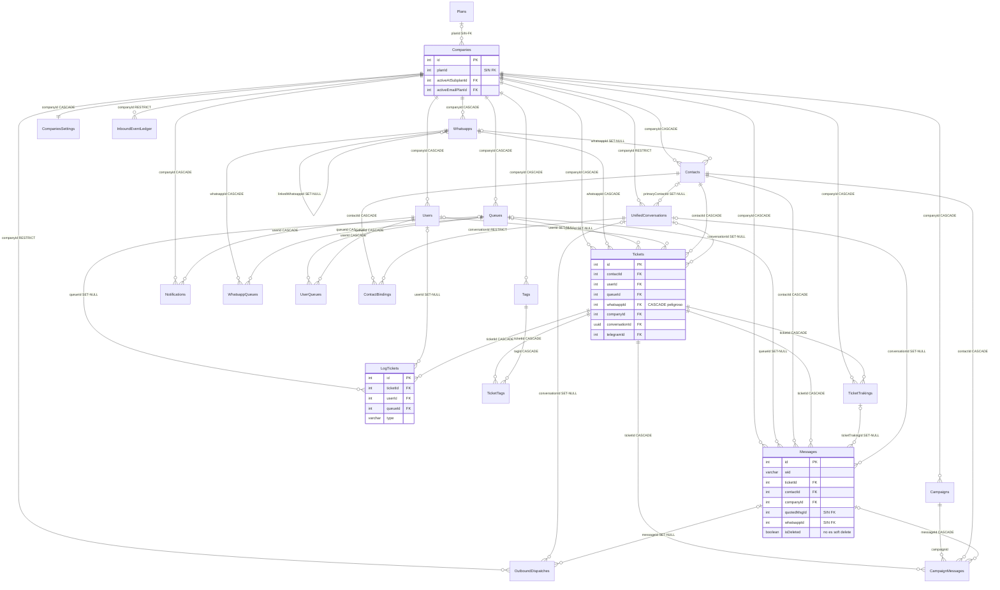

# Auditoría chateam_jr — Dominio: Base de datos, esquema e integridad

**Fecha:** 2026-07-23 · **Modo:** READ-ONLY (solo `SELECT` + lectura de ficheros) · **BD:** `chateamjr` @ 127.0.0.1:5434 (PostgreSQL 17.10, 363 MB, uptime 10d 12h)

---

## 1. Alcance revisado

| Elemento | Cantidad verificada |
|---|---|
| Tablas reales en `public` (`relkind='r'`) | **199** (0 vistas, 0 materializadas, 0 particionadas) |
| Columnas totales | 3.367 |
| Clases de modelo sequelize-typescript en `models/**` | **203** (en 183 ficheros `.ts`) |
| Modelos registrados en `sequelize.addModels` | 198 (`database/index.ts:486`) |
| Constraints FK | **393** |
| Índices | **718** |
| Migraciones `.ts` en `database/migrations/` | 385 (+ 57 `.sql` sueltos en `database/**`) |
| Registros en `SequelizeMeta` | 390 |
| Tablas con `companyId`/`company_id` | 169 · **sin columna tenant: 30** |
| Modelos con `paranoid`/`@DeletedAt` (soft delete) | **0** |

Fuentes primarias: `audit/_data/db_tables.tsv`, `audit/_data/models.tsv`, `audit/_data/db_rowcounts.tsv`, `audit/_data/models_no_registrados.txt`, más consultas directas a `pg_class`, `pg_constraint`, `pg_index`, `information_schema.columns`, `pg_stat_user_tables`, `pg_stat_user_indexes` y `SequelizeMeta`.

## 2. Método

1. **Extracción de catálogo**: volcado de tablas, columnas, FKs (con `confdeltype`), índices y estadísticas de uso desde el catálogo de Postgres.
2. **Parseo estático de modelos**: script Python sobre `models/**/*.ts` que extrae por clase el `@Table({tableName})` (o la pluralización por defecto), cada propiedad decorada con `@Column/@ForeignKey/@PrimaryKey/@CreatedAt/@UpdatedAt`, su `field:` explícito, y si es `DataType.VIRTUAL` (excluida del diff para no generar falsos positivos como `User.password` o `Ticket.alreadyOpen`).
3. **Diff bidireccional** modelo ↔ catálogo: tabla inexistente, columna declarada sin columna física, columna física no declarada, `@ForeignKey` sin constraint.
4. **Verificación de integridad real** con `SELECT ... NOT EXISTS` sobre relaciones sin FK.
5. **Diff migraciones ↔ realidad**: `SequelizeMeta` vs ficheros en disco (normalizando `.js`/`.ts`), y `createTable(...)`/`CREATE TABLE` del repo vs tablas existentes.
6. **Trazado de explotabilidad**: para los hallazgos de aislamiento se siguió ruta HTTP → controlador → servicio → cláusula `where` real.

Todo dato numérico procede de una consulta ejecutada o de un `grep` sobre fichero, no de estimación.

---

## 3. Hallazgos

### HALLAZGO DB-01 — IDOR cross-tenant: el historial completo de cualquier ticket es legible por cualquier empresa

- **Severidad:** CRÍTICO
- **Descripción:** `LogTickets` (**225.675 filas**, la tabla con más registros del sistema) no tiene columna `companyId` ni FK a `Companies`; su único vínculo con el tenant es `ticketId`. El servicio que la expone recibe `companyId` en la firma pero **nunca lo usa** en el `where`, y tampoco hace `include` de `Tickets` para acotarlo. La ruta está montada solo con `isAuth`.
- **Evidencia:**
  - `services/TicketServices/ShowLogTicketService.ts:8-12` — `interface Request { ticketId; companyId }`
  - `services/TicketServices/ShowLogTicketService.ts:15-18` — `LogTicket.findAll({ where: { ticketId } })` ← `companyId` descartado
  - `controllers/TicketController.ts:328-332` — `showLog` toma `companyId` de `req.user` y lo pasa a un servicio que lo ignora
  - `routes/ticketRoutes.ts:15` — `GET /tickets-log/:ticketId` con `isAuth` únicamente
  - Catálogo: columnas de `LogTickets` = `id, ticketId, type, userId, queueId, createdAt, updatedAt` (sin tenant)
  - Datos reales: 10 empresas distintas tienen logs (`companyId` 8=193.397 logs, 48=26.065, 6=5.073, 10=497, 1=385, 50, 49, 53, 9, 51) sobre 17 empresas registradas
- **Riesgo:** Con un `ticketId` numérico secuencial adivinable, un usuario autenticado de la empresa A obtiene la traza operativa completa (transferencias, colas, agentes, timestamps) de tickets de la empresa B. Fuga entre clientes potencialmente competidores; incumplimiento LOPDP.
- **Recomendación:** (a) parche inmediato en el servicio: `include: [{ model: Ticket, required: true, where: { companyId }, attributes: [] }]`; (b) estructural: `ALTER TABLE "LogTickets" ADD COLUMN "companyId" INTEGER REFERENCES "Companies"(id) ON DELETE CASCADE`, backfill vía `Tickets`, índice `(companyId, ticketId)` y filtro obligatorio.
- **Esfuerzo:** 1 h el parche · 4 h la columna + backfill de 225k filas
- **Confianza:** ALTA

---

### HALLAZGO DB-02 — `WebhookModel` apunta a `Webhooks` con un esquema que no existe: 8 de 11 columnas fantasma

- **Severidad:** CRÍTICO
- **Descripción:** El modelo declara `user_id, hash_id, company_id, name, active, requestMonth, requestAll, config`. La tabla física `Webhooks` tiene `id, url, method, headers, companyId, createdAt, updatedAt`. **No coincide ni una sola columna de negocio.** Sequelize construye el `SELECT` con los atributos del modelo, así que cualquier `findOne/findAll/update` falla con `column "user_id" does not exist`.
- **Evidencia:**
  - `models/Webhook.ts:3-5` — `@Table({ tableName: "Webhooks" })`
  - `models/Webhook.ts:13-33` — declaración de las 8 columnas inexistentes
  - Catálogo `Webhooks`: `id(integer), url(text), method(varchar), headers(jsonb), companyId(integer), createdAt, updatedAt`
  - Consumidores vivos: `services/FlowBuilderService/DispatchWebHookService.ts:24` (`WebhookModel.findOne`) y `:37` (`WebhookModel.update`), `services/FlowBuilderService/{CreateFlowBuilderService.ts:2, ListFlowBuilderService.ts:1, DuplicateFlowBuilderService.ts:2, UploadAllFlowBuilderService.ts:4}`, `services/FlowDefaultService/*` (3 ficheros), `services/FacebookServices/facebookMessageListener.ts:51`
  - `Webhooks` = 0 filas y 0 inserciones en 10 días de producción
- **Riesgo:** Todo el subsistema de webhooks del FlowBuilder (10 servicios) está muerto y devuelve 500 en el primer acceso. Hay dos conceptos "webhook" distintos colisionando en el mismo nombre de tabla.
- **Recomendación:** Decidir qué contrato es el vivo. Si es el del modelo → migración que añada las columnas con la convención camelCase del resto del sistema; si es el de la tabla → reescribir `models/Webhook.ts` y sus 10 consumidores. Añadir validación de arranque modelo↔catálogo.
- **Esfuerzo:** 1 día
- **Confianza:** ALTA

---

### HALLAZGO DB-03 — Memoria de contacto (RAG) rota: modelo camelCase sobre tabla snake_case sin `underscored`

- **Severidad:** CRÍTICO
- **Descripción:** `contact_memory` es snake_case en BD (`contact_id`, `company_id`, `memory_type`, `source_ticket_id`, `last_confirmed_at`, `created_at`, `updated_at`). El modelo declara las propiedades en camelCase, **no activa `underscored: true`** y además fuerza `createdAt: "createdAt"` / `updatedAt: "updatedAt"`, columnas que tampoco existen. La ruta de **lectura** usa SQL crudo (correcto); la de **escritura** usa el ORM.
- **Evidencia:**
  - `models/ContactMemory.ts:35-40` — `@Table({ tableName: "contact_memory", timestamps: true, createdAt: "createdAt", updatedAt: "updatedAt" })` sin `underscored`
  - `models/ContactMemory.ts:47-70` — `contactId`, `companyId`, `memoryType` en camelCase
  - Escritura ORM: `services/AIAgentServices/ContactMemoryService.ts:301` `ContactMemory.create({...})`, `:349` `findAll`, `:375` `destroy`
  - Lectura SQL cruda correcta: `services/AIAgentServices/ContactMemoryService.ts:71` `FROM contact_memory cm`; `controllers/AISupportCorrectionController.ts:153/176/203`
  - Consumo aguas arriba: `jobs/ExtractMemoryJob.ts:16`, `services/AIAgentServices/PromptContextBuilder.ts:195`
  - **`contact_memory` = 0 filas** pese a tener índice ivfflat y 1.656 kB reservados
- **Riesgo:** La memoria persistente por contacto —diferenciador funcional del agente IA— nunca ha persistido un registro. El job de extracción falla silenciosamente y el bloque de contexto que arma `PromptContextBuilder` siempre va vacío: el agente responde sin memoria.
- **Recomendación:** Añadir `underscored: true` y eliminar los overrides de `createdAt/updatedAt`, o declarar `field:` explícito por columna. Verificar con un `create` de humo en staging. Alertar si `ExtractMemoryJob` lanza excepción.
- **Esfuerzo:** 2 h
- **Confianza:** ALTA

---

### HALLAZGO DB-04 — El historial de migraciones no describe la base de datos real

- **Severidad:** CRÍTICO
- **Descripción:** `SequelizeMeta` no es fuente de verdad. Coexisten tres patologías: (a) migraciones registradas como aplicadas cuyas tablas no existen; (b) tablas en producción que ningún fichero del repo crea; (c) una migración aplicada cuyo efecto fue revertido a mano.
- **Evidencia:**
  - **(a) Registradas sin efecto en BD** — `SequelizeMeta` contiene `20250101000000-implement-multi-tenant-schema.js`, `20250101000001-create-media-table.js`, `20250101000001-create-tenants-table.js`, `20250101000002-create-company-billing.js`, `20250101000003-create-invoices.js`, `20250101000004-create-refunds.js`, `20250101000005-create-lead-sources.js`, `20250101000006-create-audits.js`, `20260717000001-recreate-media-table-aligned.js`. Ninguna de las tablas `tenants`, `media`, `company_billing`, `refunds`, `lead_sources`, `Audits` existe en `pg_class`. Igual con `20260520000010-create-ai-correction-review-queue.js`, `20260520000011-create-ai-correction-learned.js` y `20260603000001-create-ai-turn-events.js`.
  - **(b) 46 tablas sin sentencia de creación en el repo** (lista completa en §4.4): `AIAgentConfigs`, `AIAgentLogs`, `AIChatbotConfigs`, `AIPromptTemplates`, `AISupportCorrections`, `AITraces`, `AISpans`, `AutomationRules`, `CampaignShippings`, `CommentResponseSettings`, `CompanyBillings`, `CustomerOrigins`, `FacebookConversionEvents`, `InsightsDaily`, `Prompts`, `meta_audit_logs`, …
  - **(c) Migración aplicada, efecto revertido** — `database/migrations/20260629000001-drop-legacy-contact-number-company-unique.ts:14-18` hace `DROP INDEX IF EXISTS contacts_number_company_whatsapp_unique` y `contacts_number_company_unique`; figura como aplicada y **ambos índices siguen existiendo**. El script fuera de banda que los recrea es `scripts/optimize-contacts-indexes.sql`.
  - **Entradas fantasma** en `SequelizeMeta`: `.js`, `copy.js`, `Tickets.js` (sin fichero correspondiente). Y dos registradas con extensión `.ts` mientras las otras 388 usan `.js`: `20260416120000-add-metrics-to-campaign-shipping.ts`, `20260507100001-add-flow-and-followup-to-tickets.ts` → si el runner ejecuta desde `dist/`, las volverá a aplicar.
  - El propio repo documenta el problema: `database/migrations/20260717000001-recreate-media-table-aligned.ts:15-17` — *"el runner está DESINCRONIZADO (32 registradas en SequelizeMeta vs 384 archivos en disco) → intentaría aplicar ~352 migraciones y romper la BD"*.
  - 57 ficheros `.sql` en `database/**` (15 en `database/`, 14 en `database/sql`, 10 en `database/migrations`, 8 en `database/migrations/sql`, 5 en `expansion`, 1 en cada uno de `appointments`, `email-marketing`, `integrations`, `scaling`, `webchat`) aplicados a mano, sin registro ni idempotencia.
- **Riesgo:** No existe forma de reconstruir el entorno. Un despliegue nuevo, un staging o una restauración desde cero producen un esquema distinto al de producción. `npm run db:migrate` sobre BD limpia deja el sistema inconsistente. La recuperación ante desastre depende exclusivamente de un dump binario.
- **Recomendación:** Congelar migraciones nuevas hasta cerrar esto. Generar un **baseline**: `pg_dump --schema-only` de producción → migración única `00000000000000-baseline.ts` → resembrar `SequelizeMeta` con ese baseline + lo posterior. Versionar o eliminar los 57 `.sql`. Gate en CI que levante la BD desde migraciones y diffee contra el dump de prod.
- **Esfuerzo:** 3-5 días
- **Confianza:** ALTA

---

### HALLAZGO DB-05 — 23 modelos vivos declaran columnas que no existen: módulos completos caen con 500

- **Severidad:** ALTO
- **Descripción:** Excluyendo `DataType.VIRTUAL`, 23 clases declaran al menos una columna sin contrapartida física. Sequelize incluye todos los atributos en el `SELECT`, así que la primera consulta de cada uno falla con `column ... does not exist`. Tres módulos enteros están afectados: **Integraciones** (6/6 modelos), **Atribución** (4/4) y **Appointments IA/analytics** (2).
- **Evidencia:** (fichero:línea de la clase → columnas fantasma)

| Modelo | Tabla | Evidencia | Columnas declaradas sin existir |
|---|---|---|---|
| IntegrationConnection | integration_connections | `models/Integrations/IntegrationConnection.ts:22` | authCredentials, authExpiresAt, connectionName, createdBy, fieldMappings, lastError, syncSettings, syncStatus, webhookEvents, webhookSecret, webhookUrl |
| IntegrationEntityMapping | integration_entity_mappings | `models/Integrations/IntegrationEntityMapping.ts:17` | entityType, externalData, externalEntityId, externalEntityType, lastSyncedAt, localData, localEntityId, metadata, syncDirection |
| IntegrationWebhookEvent | integration_webhook_events | `models/Integrations/IntegrationWebhookEvent.ts:16` | connectionId, eventId, headers, processingAttempts, receivedAt, responseSent |
| IntegrationSyncLog | integration_sync_logs | `models/Integrations/IntegrationSyncLog.ts:15` | entityType, errorMessage, recordsCreated, recordsUpdated, syncType |
| IntegrationProvider | integration_providers | `models/Integrations/IntegrationProvider.ts:16` | defaultConfig, documentationUrl, iconUrl, webhookSupport |
| IntegrationApiRequest | integration_api_requests | `models/Integrations/IntegrationApiRequest.ts:15` | durationMs, endpoint, responseHeaders |
| AttributionConversion | AttributionConversions | `models/AttributionConversion.ts:23` | attributionCalculatedAt, attributionStatus, conversionSource, conversionTimestamp, convertedAt, createdBy, detectionId, firstTouchTimestamp, internalNotes, journeyId, lastTouchTimestamp, notes, status, verifiedBy |
| AttributionChannelAggregate | AttributionChannelAggregates | `models/AttributionChannelAggregate.ts:17` | 12 col. (attributedConversions, attributedRevenue, attributionModel, …) |
| AttributionTouchpoint | AttributionTouchpoints | `models/AttributionTouchpoint.ts:20` | deviceInfo, facebookAdId, facebookAdsetId, facebookCampaignId, journeyId, sequenceNumber, sessionId, touchpointTimestamp |
| AttributionResult | AttributionResults | `models/AttributionResult.ts:18` | attributedRevenue, attributionModel, attributionWeight, calculatedAt, modelParameters, periodEnd, periodStart |
| AISupportCorrection | AISupportCorrections | `models/AISupportCorrection.ts:20` | correctionType, priority, scopeJson, source, sourceAgentLogId, sourceTicketId, verifiedAt, verifiedBy |
| AppointmentAnalytics | appointment_analytics | `models/Appointments/AppointmentAnalytics.ts:16` | 10 col. (totalScheduled, totalCompleted, revenueGenerated, peakHour, …) |
| AppointmentAISuggestion | appointment_ai_suggestions | `models/Appointments/AppointmentAISuggestion.ts:18` | aiModel, aiTokensUsed, alternativeTimes, confidenceScore, suggestionType, userId |
| ContactMemory | contact_memory | `models/ContactMemory.ts:35` | companyId, contactId, lastConfirmedAt, memoryType, sourceTicketId (ver DB-03) |
| WebhookModel | Webhooks | `models/Webhook.ts:6` | 8 col. (ver DB-02) |
| ScheduledMessagesEnvio | ScheduledMessagesEnvios | `models/ScheduledMessagesEnvio.ts:3` | data_envio, key, mediaName, mediaPath, scheduledmessages |
| AiTokenPlan | AiTokenPlans | `models/AiTokenPlan.ts:12` | description, features, isArchived |
| ApplePurchase | ApplePurchases | `models/ApplePurchase.ts:17` | platform, receiptData, verifiedAt |
| FlowDefaultModel | FlowDefaults | `models/FlowDefault.ts:12` | flowIdNotPhrase, flowIdWelcome |
| TicketNote | TicketNotes | `models/TicketNote.ts:19` (col. en `:36-38`) | contactId (además declarada como `@ForeignKey(() => Contact)`) |
| Files | Files | `models/Files.ts:16` (col. en `:32-33`) | message |
| FilesOptions | FilesOptions | `models/FilesOptions.ts:16` | mediaType |

- **Confirmación de rutas vivas (no código muerto):** `services/IntegrationServices/BaseIntegrationService.ts:3` y `controllers/IntegrationController.ts:3` importan `IntegrationConnection`; `services/AppointmentServices/AISchedulingService.ts:2,146,329,404,522` usa `AppointmentAISuggestion` con `create/update/findAll`; `services/FileServices/{Create,Update,List,Delete,DeleteAll}Service.ts` usan `Files`.
- **Riesgo:** Cinco superficies de producto (Integraciones, Atribución de conversiones, Sugerencias IA de citas, Analytics de citas, Ficheros de cola) devuelven 500 en su primer uso. Corroborado por contadores: `integration_*`, `Attribution*`, `appointment_ai_suggestions`, `appointment_analytics`, `Files` y `FilesOptions` tienen **0 filas y 0 inserciones**.
- **Recomendación:** Por módulo, decidir si el contrato correcto es el modelo (→ migración de alineación) o la tabla (→ corregir el modelo). Priorizar Integraciones (6 modelos, controlador expuesto). Después, validador de arranque que compare `Model.rawAttributes` contra `information_schema.columns` y falle rápido en staging.
- **Esfuerzo:** 3-4 días para los 23
- **Confianza:** ALTA

---

### HALLAZGO DB-06 — Cero soft delete + 225 FK en CASCADE: borrar una conexión de WhatsApp destruye el histórico de conversaciones

- **Severidad:** ALTO
- **Descripción:** No existe una sola columna `deletedAt` en las 199 tablas, ni un modelo con `paranoid: true` o `@DeletedAt` (0/203). Todos los borrados son físicos. Sobre esa base, 225 de 393 FKs son `ON DELETE CASCADE`, incluida `Tickets.whatsappId → Whatsapps`, que encabeza una cascada de 3 niveles.
- **Evidencia:**
  - Catálogo: 0 filas para `column_name IN ('deletedAt','deleted_at')`; `grep -rln "paranoid\|@DeletedAt" models/` sin resultados
  - Distribución `confdeltype`: **c(CASCADE)=225**, n(SET NULL)=117, a(NO ACTION)=42, r(RESTRICT)=9
  - `Tickets_whatsappId_fkey`: `FOREIGN KEY ("whatsappId") REFERENCES "Whatsapps"(id) ON DELETE CASCADE`
  - Cascada de 2.º nivel desde `Tickets`: `Messages` (79.195 filas), `LogTickets` (225.675), `TicketTrakings` (6.727), `CampaignMessages` (3.650), `TicketTags` (973), `KanbanMovementLogs` (495), `Schedules`, `TicketNotes`, `UserRatings`
  - Punto de entrada: `services/WhatsappService/DeleteWhatsAppService.ts:13` → `await whatsapp.destroy();`
  - Cascadas equivalentes al dar de baja un agente: `TicketNotes_userId_fkey`, `UserRatings_userId_fkey`, `ChatMessages_senderId_fkey`, `Chats_ownerId_fkey`, todas CASCADE → destruyen histórico de auditoría
- **Riesgo:** Un clic en "eliminar conexión" borra de forma irrecuperable todo el historial conversacional de esa línea. No hay papelera ni `deletedAt`; la recuperación exige restaurar un dump completo.
- **Recomendación:** (a) inmediato: cambiar `Tickets.whatsappId` a `ON DELETE RESTRICT` (o `SET NULL` si el ticket debe sobrevivir), forzando archivado previo; (b) introducir `deletedAt` + `paranoid` en entidades de negocio (`Whatsapps`, `Users`, `Contacts`, `Queues`, `Tags`, `Campaigns`); (c) reservar CASCADE a tablas puente y logs propios.
- **Esfuerzo:** 2 días para (a)+(c); 1 semana para (b) con revisión de los `where` afectados
- **Confianza:** ALTA

---

### HALLAZGO DB-07 — `DeleteCompanyService` es inejecutable para empresas con módulo de citas activo

- **Severidad:** ALTO
- **Descripción:** El sistema resuelve el borrado de empresa con CASCADE, pero el módulo de citas creó sus FKs a `Companies` en `NO ACTION`. Como Postgres evalúa todas las FKs en la misma transacción, `company.destroy()` aborta con violación de FK en cuanto la empresa tiene una fila en `appointments` o `appointment_*`.
- **Evidencia:**
  - `services/CompanyService/DeleteCompanyService.ts:13` — `await company.destroy();`
  - FKs `NO ACTION` hacia `Companies`: `appointments_companyId_fkey`, `appointment_ai_suggestions_companyId_fkey`, `appointment_analytics_companyId_fkey`, `appointment_availability_companyId_fkey`, `appointment_calendar_sync_companyId_fkey`, `appointment_reminders_companyId_fkey`, `CommentAutoReplyCampaigns_companyId_fkey`, `CommentAutoReplyLogs_companyId_fkey`, `CompanyEmailPlans_companyId_fkey`
  - Datos vivos que disparan el fallo: `appointment_availability`=143, `appointment_reminders`=66, `appointments`=38, `appointment_services`=4, `appointment_calendar_sync`=2, `appointment_blocks`=1
  - Contraste: la tabla gemela `appointment_calendar_syncs` sí usa CASCADE — dos convenciones opuestas conviviendo
- **Riesgo:** Baja de cliente imposible por la vía soportada; se resuelve a mano en psql con riesgo de huérfanos o de borrar de más. Impide cumplir una solicitud de supresión de datos en plazo.
- **Recomendación:** Unificar el módulo de citas a `ON DELETE CASCADE` hacia `Companies`, o —preferible— implementar un `DeleteCompanyService` transaccional que recorra las dependencias en orden explícito en lugar de delegar en las FKs.
- **Esfuerzo:** 1 día
- **Confianza:** ALTA

---

### HALLAZGO DB-08 — 43 relaciones declaradas en los modelos no tienen FK en la BD, y ya hay filas huérfanas

- **Severidad:** ALTO
- **Descripción:** 43 columnas decoradas con `@ForeignKey(() => X)` existen físicamente pero sin constraint. La integridad depende sólo del código de aplicación, y ya ha fallado.
- **Evidencia:**
  - Huérfanos verificados por `SELECT`:
    - `ApiFailedMessages.whatsappId` → **271 de 273 filas** apuntan a un `Whatsapps.id` inexistente
    - `Users.whatsappId` → **3 filas** huérfanas
  - Relaciones sin constraint en tablas núcleo: `Messages.quotedMsgId → Message` y `Messages.whatsappId → Whatsapp` (`models/Message.ts:22`), `Companies.planId → Plan` (`models/Company.ts:30`), `Users.whatsappId → Whatsapp` (`models/User.ts:31`), `Whatsapps.{promptId, integrationId, sendIdQueue, queueIdImportMessages, flowIdNotPhrase, flowIdWelcome}` (`models/Whatsapp.ts:27`), `Chatbots.{chatbotId, optQueueId, optUserId, optIntegrationId, optFileId}` (`models/Chatbot.ts:21`), `ChatMessages.companyId` (`models/ChatMessage.ts:19`), `AttributionTouchpoints.{ticketId, messageId, campaignShippingId}` (`models/AttributionTouchpoint.ts:20`), `integration_*.companyId` (6 tablas), `appointment_blocks.{companyId,userId}` (`models/Appointments/AppointmentBlock.ts:16`)
- **Riesgo:** Datos silenciosamente inconsistentes. `Messages.quotedMsgId` sin FK permite citas colgantes que rompen el render del chat; `ChatMessages.companyId` e `integration_*.companyId` sin FK admiten filas con tenant inexistente o cruzado que ningún `JOIN` detendrá.
- **Recomendación:** Limpiar huérfanos (`UPDATE ... SET "whatsappId" = NULL WHERE NOT EXISTS ...`) y crear los constraints con `NOT VALID` + `VALIDATE CONSTRAINT` para no bloquear tablas grandes. Priorizar las 32 columnas `companyId` sin FK (DB-09).
- **Esfuerzo:** 2 días
- **Confianza:** ALTA

---

### HALLAZGO DB-09 — 32 tablas multi-tenant tienen `companyId` sin FK a `Companies`

- **Severidad:** ALTO
- **Descripción:** El discriminador de tenant carece de integridad referencial en 32 tablas, varias con datos vivos y contenido sensible (trazas de IA, auditoría, cache semántico, suplantación de identidad).
- **Evidencia (tabla → filas):** `InsightsDaily`(1.589), `meta_audit_logs`(775), `AISemanticCache`(287), `ApiFailedMessages`(273), `AITraces`, `AISpans`, `AIUsageMetrics`, `AIABTests`, `AIABTestVariants`, `AIAffiliatePrograms`, `AIChatbotDomains`, `AIFineTuningJobs`, `AIImageGenerationItems`, `AIScheduledTasks`, `AIVideoCreditTransactions`, `AIVideoGenerationItems`, `AIVideoGenerations`, `AutomationRules`, `ChatMessages`, `FlowCampaigns`, `UserTermsAcceptances`, `appointment_blocks`, `campaign_approvals`, `comment_moderation_audits`, `impersonation_audits`, `integration_api_requests`, `integration_connections`, `integration_entity_mappings`, `integration_sync_logs`, `integration_webhook_events`, `recommendation_runs`, `sensitive_categories`.
- **Riesgo:** Un bug de asignación de `companyId` no se detecta a nivel de BD. `AISemanticCache` sin FK es especialmente delicado: un `companyId` erróneo sirve respuestas cacheadas de otro tenant. `impersonation_audits` sin FK degrada el valor probatorio del registro.
- **Recomendación:** `ALTER TABLE ... ADD CONSTRAINT ... FOREIGN KEY ("companyId") REFERENCES "Companies"(id) ON DELETE CASCADE NOT VALID;` seguido de `VALIDATE`. Añadir índice sobre `companyId` en `ApiFailedMessages` (única tabla >100 filas cuyo `companyId` no encabeza ningún índice).
- **Esfuerzo:** 1 día
- **Confianza:** ALTA

---

### HALLAZGO DB-10 — `sync-database.ts` puede reescribir el esquema de producción a partir de modelos derivados

- **Severidad:** ALTO
- **Descripción:** Existe un script que ejecuta `sequelize.sync({ alter: true })` contra la BD apuntada por el entorno. Dado el drift de DB-02/DB-03/DB-05, ejecutarlo añadiría columnas fantasma, duplicaría columnas en snake/camel y alteraría tipos en 199 tablas de producción.
- **Evidencia:**
  - `sync-database.ts:21` — `await sequelize.sync({ alter: true });`
  - `sync-database.ts:2` — `import sequelize from "./database"` (usa `config/database` → `DB_*` del entorno; el proceso PM2 3948697 apunta a `chateamjr` en 127.0.0.1:5434)
  - No hay guardia por `NODE_ENV` ni confirmación interactiva
  - Patrón repetido en `sync-appointments-only.ts`
- **Riesgo:** Un `ts-node sync-database.ts` sobre el entorno equivocado provoca un incidente de esquema irreversible. `alter: true` genera `ALTER TABLE ... TYPE` que puede reescribir tablas de 192 MB (`Messages`) bloqueándolas.
- **Recomendación:** Guardia `if (process.env.NODE_ENV === "production") throw` al inicio, o mover a `_cuarentena/`. No reactivar `sync` mientras exista el drift.
- **Esfuerzo:** 15 min
- **Confianza:** ALTA (el fichero y la línea son hecho verificado; que hoy se invoque no consta — no está en `package.json`)

---

### HALLAZGO DB-11 — 14 modelos apuntan a tablas inexistentes; 3 módulos son esqueletos completos

- **Severidad:** MEDIO
- **Descripción:** Catorce clases declaran `tableName` de tablas que no existen en `pg_class`. Tres (`WebChat*`) forman un módulo completo que además no está registrado en `addModels`.
- **Evidencia:**

| Modelo | `tableName` declarado | Evidencia | Registrado | Importado en negocio |
|---|---|---|---|---|
| WebChatChannel | webchat_channels | `models/WebChat/WebChatChannel.ts:19` | NO | NO |
| WebChatSession | webchat_sessions | `models/WebChat/WebChatSession.ts:20` | NO | NO |
| WebChatMessage | webchat_messages | `models/WebChat/WebChatMessage.ts:17` | NO | NO |
| AICorrectionLearned | AICorrectionLearned | `models/AICorrectionLearned.ts:46` | SÍ | SÍ |
| AICorrectionReviewQueue | AICorrectionReviewQueue | `models/AICorrectionReviewQueue.ts:42` | SÍ | SÍ |
| AITurnEvent | AITurnEvents | `models/AITurnEvent.ts:18` | SÍ | SÍ |
| ConversionDetection | ConversionDetections | `models/ConversionDetection.ts:20` | SÍ | NO |
| ConversionItem | ConversionItems | `models/ConversionItem.ts:17` | SÍ | NO |
| Product | Products | `models/Product.ts:18` | SÍ | NO |
| CompanyBilling | company_billing | `models/CompanyBilling.ts:192` | NO | — |
| Media | media | `models/Media.ts:370` | NO | — |
| Invoice | invoices (minúscula) | `models/Invoice.ts:242` | NO | — |
| Refund | refunds | `models/Refund.ts:155` | NO | — |
| LeadSource | lead_sources | `models/LeadSource.ts:417` | NO | — |

- Los cinco últimos usan el estilo clásico `Model.init(...)` en lugar de decoradores, no están en `sequelize.addModels` (coincide con `audit/_data/models_no_registrados.txt`) y apuntan a tablas snake/minúscula inexistentes; la BD sí tiene `CompanyBillings` e `Invoices` en PascalCase (ambas con 0 filas).
- `AICorrectionLearned`, `AICorrectionReviewQueue` y `AITurnEvents` se usan en código vivo y sus migraciones (`20260520000010`, `20260520000011`, `20260603000001`) figuran aplicadas — **pero las tablas no existen**: caso concreto del patrón de DB-04.
- **Riesgo:** Registrar un modelo cuya tabla no existe hace fallar cualquier `include` que lo referencie; el loop de aprendizaje desde correcciones humanas (Sprint 2026-05-20) está inoperativo. Los modelos `Model.init` no registrados son código zombi que distorsiona el mapa del esquema.
- **Recomendación:** Crear las tres tablas `AICorrection*`/`AITurnEvents` re-ejecutando sus migraciones de forma quirúrgica; mover `WebChat/*`, `Product`, `Conversion*`, `CompanyBilling`, `Media`, `Invoice`, `Refund`, `LeadSource` a `_cuarentena/` (política de no borrar).
- **Esfuerzo:** 1 día
- **Confianza:** ALTA

---

### HALLAZGO DB-12 — Tablas duplicadas por deriva de nomenclatura: `CampaignShipping`/`CampaignShippings` y `appointment_calendar_sync`/`_syncs`

- **Severidad:** MEDIO
- **Descripción:** Dos pares de tablas casi idénticas conviven; en cada par sólo una está cableada al modelo, la otra recibe FKs y ocupa espacio sin uso.
- **Evidencia:**
  - `CampaignShipping` (17 col.: incluye `attemptCount`, `failedAt`, `errorMessage`, `metaMessageId`) vs `CampaignShippings` (13 col., sin esas cuatro). El modelo apunta a la singular: `models/CampaignShipping.ts:17` `@Table({ tableName: "CampaignShipping" })`; consumidores en `services/WbotServices/wbotMessageListener.ts:78`, `jobs/Campaign.ts:4`, `services/CampaignService/ShowService.ts:4`, `services/CampaignService/CleanupCampaignJobsService.ts:5`. Ambas con 0 filas.
  - `appointment_calendar_sync` (15 col., `isEnabled`, `settings`, `calendarName`, `syncDirection`, **2 filas**, FK a `Companies` en NO ACTION) vs `appointment_calendar_syncs` (13 col., `syncEnabled`, `metadata`, 0 filas, FK en CASCADE). El modelo usa la singular: `models/Appointments/AppointmentCalendarSync.ts:19`.
  - Ninguna migración del repo crea las variantes plurales (`CampaignShippings`, `appointment_calendar_syncs` están entre las 46 tablas sin sentencia de creación).
- **Riesgo:** Confusión operativa; consultas manuales o de BI contra la tabla equivocada devuelven vacío. Divergencia de columnas (`attemptCount`, `errorMessage`) que un futuro desarrollador puede intentar "arreglar" en el lado muerto.
- **Recomendación:** Confirmar por `pg_stat_user_tables` que la variante huérfana no recibe escrituras, renombrarla a `_deprecated_*` durante un ciclo y eliminarla después en migración versionada.
- **Esfuerzo:** 3 h
- **Confianza:** ALTA

---

### HALLAZGO DB-13 — Índices `UNIQUE` contradictorios en `Contacts`: el modelo canónico y el multicanal coexisten

- **Severidad:** MEDIO
- **Descripción:** `Contacts` arrastra índices únicos con semánticas incompatibles simultáneamente activos, resultado de la reversión descrita en DB-04.
- **Evidencia** (`pg_indexes`):
  - `Contacts_number_companyId_key` — `UNIQUE (number, "companyId")` **incondicional** (también presente como constraint en `pg_constraint`)
  - `contacts_number_company_unique` — `UNIQUE (number, "companyId") WHERE "whatsappId" IS NULL`
  - `contacts_number_company_whatsapp_unique` — `UNIQUE (number, "companyId", "whatsappId") WHERE "whatsappId" IS NOT NULL`
  - `contacts_remotejid_company_whatsapp_unique` — `UNIQUE ("remoteJid","companyId","whatsappId") WHERE ...`
  - Las dos parciales debían estar eliminadas según `database/migrations/20260629000001-drop-legacy-contact-number-company-unique.ts:14-18`, migración registrada como aplicada
  - Índices auxiliares redundantes en la misma tabla: `idx_contacts_company`, `idx_contacts_number`, `contacts_remotejid_idx`, `idx_Contacts_whatsappId`. Tres índices (`Contacts_number_companyId_key`, `contacts_number_company_unique`, `contacts_remotejid_company_whatsapp_unique`) acumulan **0 scans en 10 días** (1.112 kB)
- **Riesgo:** El índice incondicional gana siempre: impide que el mismo número exista en dos conexiones de WhatsApp de la misma empresa, anulando de facto el modelo multicanal que las parciales pretendían habilitar. Los inserts de contactos de una segunda línea fallan por violación de unicidad.
- **Recomendación:** Decidir el modelo de identidad (canónico por empresa vs por conexión), dejar **un** índice único y borrar los otros en migración versionada. Consolidar los auxiliares en un compuesto `(companyId, number)`.
- **Esfuerzo:** 4 h + validación funcional
- **Confianza:** ALTA

---

### HALLAZGO DB-14 — Convención de nombres fracturada en tres dialectos

- **Severidad:** MEDIO
- **Descripción:** Las 199 tablas se reparten en tres convenciones y las columnas mezclan camelCase con snake_case dentro de la misma base; es la causa raíz mecánica de DB-03 y de varias entradas de DB-05.
- **Evidencia:**
  - **169 PascalCase** (`Tickets`, `AIAgentLogs`, `UGCVideoJobs`, …)
  - **29 snake_case** (`appointment_*` ×8, `email_*` ×8, `integration_*` ×6, `contact_memory`, `meta_audit_logs`, `campaign_approvals`, `comment_moderation_audits`, `impersonation_audits`, `recommendation_runs`, `reminder_templates`, `sensitive_categories`)
  - **1 minúscula simple**: `appointments`
  - Columnas mixtas en la misma tabla: `Tickets.followup_count` junto a `Tickets.nextFollowupAt`, `lastFollowupAt`, `sourceKind`
  - Tablas snake_case cuyo modelo declara camelCase sin `underscored`: `contact_memory`, `integration_*` (6), `appointment_ai_suggestions`, `appointment_analytics`
- **Riesgo:** Cada tabla nueva es una tirada de dados: si el autor no recuerda activar `underscored: true`, nace otro módulo muerto. Obliga además a citar identificadores en todo el SQL crudo.
- **Recomendación:** Fijar la convención en `CLAUDE.md`/`docs/` (recomendado: mantener PascalCase por peso histórico) y añadir un test que falle si un modelo nuevo declara `tableName` snake_case sin `underscored: true`.
- **Esfuerzo:** 2 h (norma + test); migración de renombrado masivo no recomendada
- **Confianza:** ALTA

---

### HALLAZGO DB-15 — Búsqueda vectorial sin índice en 3 de las 6 columnas `vector`

- **Severidad:** MEDIO
- **Descripción:** El sistema usa pgvector en seis columnas, pero sólo tres tienen índice ANN. Las tres sin índice incluyen la del pipeline RAG de documentos y la del cache semántico.
- **Evidencia:**

| Tabla.columna | Índice | Filas |
|---|---|---|
| `AIHistoricalQA.embedding` | `idx_historical_qa_embedding` ivfflat lists=100 | 0 |
| `QuickMessages.intentEmbedding` | `idx_quick_messages_intent_embedding` ivfflat lists=20 | 36 |
| `contact_memory.embedding` | `idx_contact_memory_embedding` ivfflat lists=100 | 0 |
| **`AIChunks.embedding`** | **ninguno** | 34 |
| **`AISemanticCache.queryEmbedding`** | **ninguno** | 287 |
| **`AISupportCorrections.embedding`** | **ninguno** | 0 |

- Contradicción adicional: las tres columnas **con** índice están vacías o casi; las tres **sin** índice son las que tienen datos.
- **Riesgo:** Cada consulta de similitud sobre `AIChunks` y `AISemanticCache` es un seq scan con cálculo de distancia por fila. Con 34 y 287 filas es imperceptible, pero el cache semántico se consulta en cada turno de conversación: al crecer a decenas de miles de entradas la latencia del agente se degrada de forma no lineal y sin aviso.
- **Recomendación:** Crear índices HNSW (mejor recall/latencia que ivfflat y sin recalibrar `lists`): `CREATE INDEX CONCURRENTLY ... USING hnsw (embedding vector_cosine_ops)`. Revisar los ivfflat con `lists=100` sobre tablas vacías: con pocos datos degradan el recall.
- **Esfuerzo:** 2 h
- **Confianza:** ALTA (existencia de índices y filas) / MEDIA (impacto de latencia proyectado: no se ejecutó `EXPLAIN ANALYZE`)

---

### HALLAZGO DB-16 — 82 tablas (41 % del esquema) nunca han recibido una sola inserción

- **Severidad:** MEDIO
- **Descripción:** De las 199 tablas, 82 tienen `n_live_tup = 0` **y** `n_tup_ins = 0`. Además, 16 clases de modelo no se importan desde ningún fichero de `controllers/`, `services/`, `jobs/`, `workers/`, `libs/`, `helpers/`, `routes/`, `middleware/` ni `utils/`.
- **Evidencia:**
  - `SELECT count(*) FROM pg_stat_user_tables WHERE schemaname='public' AND n_live_tup=0 AND n_tup_ins=0` → **82**
  - Modelos sin ningún import en código de negocio: `ConversionDetection`, `ConversionItem`, `Product`, `TelegramQueue`, `WhatsappQueue`, `Subscriptions`, `ApplePurchase`, `AiTokenPlan`, `AIHistoricalQA`, `AISemanticCache`, `AIUsageMetric`, `MetaAuditLog`, `AppointmentAnalytics`, `WebChatChannel`, `WebChatSession`, `WebChatMessage`
  - Bloques completos sin actividad: `UGC*` (11 tablas), `Attribution*` (4), `Affiliate*`/`AIAffiliate*` (7), `Agent*` (5), `AITeams`/`AITeamMembers`/`AITraces`/`AISpans`, `integration_*` (6), `email_*` parcial
  - Matiz: `AISemanticCache` (287 filas) y `meta_audit_logs` (775) sí tienen datos pese a que su modelo no se importa → se escriben por SQL crudo, no por ORM
- **Riesgo:** El esquema real es ~2,4× más grande que el producto en uso. Cada auditoría, migración, backup y `sequelize.sync` paga ese peso. Distinguir "roto" de "no lanzado todavía" exige arqueología, lo que ralentiza cualquier intervención.
- **Recomendación:** Etiquetar cada bloque muerto en `docs/` como *no lanzado* o *abandonado*. Para los abandonados, migración de eliminación versionada. Secuenciar después de DB-01…DB-05: primero arreglar lo vivo, luego podar.
- **Esfuerzo:** 2 días de clasificación
- **Confianza:** ALTA (contadores) / MEDIA (clasificación roto vs no-lanzado, que es inferencia)

---

### HALLAZGO DB-17 — Unicidades globales sobre tablas multi-tenant permiten colisión y bloqueo entre empresas

- **Severidad:** BAJO
- **Descripción:** 17 índices únicos sobre tablas que sí tienen `companyId` no lo incluyen en la clave, convirtiendo el espacio de nombres en global.
- **Evidencia:** `Telegrams_name_key UNIQUE(name)`, `Telegrams_botToken_key UNIQUE("botToken")`, `AIChatbotDomains_domain_key UNIQUE(domain)`, `AIChatbotDomains_appKey_key`, `AIChatbotDomains_uuid_key`, `AIAffiliatePrograms_referralCode_key`, `AffiliateLinks_slug_key` (+ duplicado `idx_affiliate_links_slug`), `AgentDevices_deviceId_key`, `FacebookDatasets_datasetId_key`, `FacebookConversionEvents_facebookEventId_key`, `WebChatWidgets_apiKey_key`, `Users_email_key UNIQUE(email)`, `contact_memory_contact_id_content_key`.
- **Riesgo:** La empresa A puede ocupar un `Telegrams.name` o un `AffiliateLinks.slug` y bloquear a la empresa B (DoS de nombres); el error de unicidad además revela por enumeración que el valor ya existe en otro tenant. Sobre `Users_email_key`: podría ser intencional dado que existe `CompanyUsers` para usuarios multi-empresa — **no verificable con la evidencia disponible** sin la especificación de producto.
- **Recomendación:** Reemplazar por `UNIQUE (companyId, <campo>)` en `Telegrams.name`, `AffiliateLinks.slug` y `AIAffiliatePrograms.referralCode`. Mantener global sólo donde el valor sea globalmente único por naturaleza (`apiKey`, `botToken`, `deviceId`, `facebookEventId`).
- **Esfuerzo:** 4 h
- **Confianza:** MEDIA

---

### HALLAZGO DB-18 — 11 pares de índices duplicados y 20 índices sin uso en tablas grandes

- **Severidad:** BAJO
- **Descripción:** Índices redundantes exactos (misma tabla, mismo `indkey`, misma parcialidad) e índices sin una sola lectura en 10 días de producción.
- **Evidencia:**
  - **Duplicados exactos:** `AiTokenTransactions` (`idx_aitokentrans_company` ∥ `idx_aitokentransactions_companyid`), `Users` (`Users_email_key` ∥ `idx_users_email`), `Plans` (`Plans_name_key` ∥ `unique_plan_name`), `ApiUsages`, `AgentDevices`, `AffiliateLinks`, `WebChatWidgets`, `CompanyTokenUsages`, `AIAffiliatePrograms`, `MetaOfficialMcpConnections`, `campaign_approvals`
  - **Sin uso (`idx_scan=0`) en tablas >1.000 filas**, top por tamaño: `idx_inbound_event_ledger_company_eventkey_unique` (5.920 kB / 77.494 filas), `idx_messages_wid_companyid_unique` (5.040 kB / 79.195), `idx_messages_provider_externalid` (4.992 kB), `LogTickets_pkey` (4.976 kB / 225.675), `idx_inbound_event_ledger_provider_msg_id` (4.544 kB), `Notifications_pkey` (688 kB / 30.637), `idx_messages_conversation_id` (552 kB)
  - `Messages` = 192 MB totales con 25 MB de índices; `InboundEventLedger` = 43 MB con **21 MB** de índices (49 % de overhead)
- **Riesgo:** Coste de escritura en las dos tablas más calientes del sistema sin beneficio de lectura.
- **Nota de interpretación:** los índices `UNIQUE` también se usan para verificar la restricción en `INSERT`, y esa verificación **no** incrementa `idx_scan`. Por tanto `idx_inbound_event_ledger_company_eventkey_unique` e `idx_messages_wid_companyid_unique` sí cumplen su función de idempotencia pese a marcar 0 scans; **no deben eliminarse**. Los candidatos reales a poda son los no únicos: `idx_messages_provider_externalid`, `idx_messages_conversation_id` y los 11 duplicados.
- **Recomendación:** Eliminar un índice de cada par duplicado y los dos no únicos de `Messages` sin uso. Reevaluar a 30 días tras un `pg_stat_reset()` controlado.
- **Esfuerzo:** 2 h
- **Confianza:** ALTA (duplicados) / MEDIA (poda por desuso: ventana de 10 días)

---

## 4. Tablas y diagramas solicitados

### 4.1 Diagrama ER — 20 tablas núcleo

Relaciones tomadas de `pg_constraint` (sólo FKs reales). Las etiquetas indican `ON DELETE`.

> `LogTickets` aparece deliberadamente **sin `companyId`**: es el hallazgo DB-01.

### 4.2 Resumen modelos ↔ tablas

| Categoría | Nº | Detalle |
|---|---|---|
| Clases de modelo parseadas | 203 | en 183 ficheros |
| Modelos con tabla existente y columnas coincidentes | 166 | |
| Modelos con ≥1 columna declarada inexistente | **23** | DB-05 |
| Modelos cuya tabla **no existe** | **14** | DB-11 |
| Modelos no registrados en `addModels` | 8 reales | `ApplePurchase`, `WebChatChannel/Session/Message`, + `CompanyBilling`, `Media`, `Invoice`, `Refund`, `LeadSource` (estilo `Model.init`) |
| Modelos nunca importados en código de negocio | 16 | DB-16 |
| Tablas con >1 modelo apuntando | 1 | `appointment_services` ← `models/AppointmentService.ts:16` **y** `models/Appointments/AppointmentService.ts:16` (duplicado) |

### 4.3 Resumen de FKs

| `ON DELETE` | Nº | % | Comentario |
|---|---|---|---|
| CASCADE (`c`) | 225 | 57 % | Sin red de seguridad: no hay soft delete (DB-06) |
| SET NULL (`n`) | 117 | 30 % | Correcto en su mayoría |
| NO ACTION (`a`) | 42 | 11 % | Bloquea el borrado de empresa (DB-07) |
| RESTRICT (`r`) | 9 | 2 % | Sólo bloque coexistencia (`InboundEventLedger`, `UnifiedConversations`, `ContactBindings`, `OutboundDispatches`, `email_*`) |
| **Total** | **393** | | + **43** relaciones declaradas en modelos sin constraint (DB-08) |

### 4.4 Tablas sin sentencia de creación en el repositorio (46)

`AIABTests`, `AIABTestVariants`, `AIAffiliatePrograms`, `AIAffiliateReferrals`, `AIAgentAssignments`, `AIAgentConfigs`, `AIAgentLogs`, `AIChatbotConfigs`, `AIChatbotDataSources`, `AIChatbotDomains`, `AICompanyExtensions`, `AIEmailTemplates`, `AIExtensions`, `AIFineTuningJobs`, `AIPromptTemplates`, `AIScheduledTasks`, `AISemanticCache`, `AISpans`, `AISupportCorrections`, `AITeamMembers`, `AITeams`, `AITraces`, `AIUsageLogs`, `AIUsageMetrics`, `appointment_calendar_syncs`, `AutomationRules`, `CampaignShippings`, `comment_moderation_audits`, `CommentResponseSettings`, `CompanyBillings`, `CompanyTokenUsages`, `CustomerOrigins`, `FacebookConversionEvents`, `FacebookDatasets`, `impersonation_audits`, `InsightsDaily`, `KanbanLeadConversionEvents`, `meta_audit_logs`, `MetaMarketingAuditLogs`, `Prompts`, `reminder_templates`, `Roles`, `sensitive_categories`, `TicketTrakings`, `UserTermsAcceptances`, `WhatsAppTemplates`.

### 4.5 Objetos que el repositorio crea y que no existen en la BD (63)

`ai_prompt_templates`, `ai_template_categories`, `ai_template_executions`, `ai_template_ratings`, `AiTokenWallets`, `Audits`, `CompanyBilling`, `company_language_settings`, `company_shard_mapping`, `CompanyTokenUsage`, `ContactGroups`, `content_translations`, `ConversionDetections`, `conversion_funnels`, `ConversionItems`, `custom_dashboards`, `custom_kpis`, `daily_metrics`, `dashboard_widgets`, `email_ai_suggestions`, `email_analytics_daily`, `email_unsubscribes`, `funnel_analytics`, `instagram_quick_replies`, `integration_analytics`, `integration_queue`, `Integrations`, `LeadSources`, `media`, `Media`, `module_actions`, `permission_audit_log`, `Products`, `Refunds`, `role_permissions`, `scheduled_reports`, `shard_metadata`, `shard_rebalance_history`, `social_audience`, `social_campaigns`, `social_channels`, `social_mentions`, `social_messages`, `social_stories`, `social_webhook_events`, `supported_languages`, `system_modules`, `tenants`, `TicketTraking`, `translatable_content`, `translation_glossary`, `translation_stats`, `ui_translations`, `user_cohorts`, `user_events`, `user_language_preferences`, `user_permissions`, `user_retention`, `user_sessions`, `webchat_analytics`, `webchat_channels`, `webchat_messages`, `webchat_sessions`.

### 4.6 Tablas sin discriminador de tenant (30)

| Tabla | Filas | Valoración |
|---|---|---|
| `LogTickets` | 225.675 | **Riesgo activo** — DB-01 |
| `Baileys` | 8.762 | Aceptable: se accede siempre por `whatsappId` (FK CASCADE) |
| `Sessions` | 1.971 | Aceptable: tiene `userId` (FK CASCADE) y `activeCompanyId` |
| `TicketTags` | 973 | Aceptable: tabla puente, ambas FKs CASCADE |
| `PlanCreditAllocations` | 92 | Catálogo global por diseño |
| `AIEntities` | 57 | Catálogo global |
| `UserQueues`, `CompanyUserQueues`, `ContactTags` | 38 / 33 / 24 | Puentes |
| `Companies`, `AICreditTypes`, `AIExtensions`, `AiTokenPlans`, `Plans`, `EmailPlans` | 17 / 23 / 12 / 10 / 5 / 3 | Catálogos globales, correcto |
| `ChatUsers`, `WhatsappQueues`, `PromptQueues` | 12 / 6 / 2 | Puentes |
| `SequelizeMeta` | 390 | Metadatos |
| 11 tablas restantes | 0 | Módulos sin lanzar |

**Conclusión:** de las 30, sólo `LogTickets` constituye una brecha real; el resto está justificado por ser puente, catálogo o metadato. El dato de "36 modelos sin `companyId`" del inventario incluye además modelos cuya tabla no existe.

### 4.7 Soft delete

| Mecanismo | Presencia |
|---|---|
| `deletedAt` / `deleted_at` en BD | **0 tablas de 199** |
| `paranoid: true` en modelos | **0 de 203** |
| `@DeletedAt` en modelos | **0 de 203** |
| `isDeleted` (booleano, semántica de proveedor) | 2 tablas: `Messages`, `UGCPostComments` |
| `isActive` | 29 tablas |
| `active` | 5 tablas |
| `status` | 69 tablas |

No hay soft delete: hay cuatro convenciones distintas de "desactivación" y ninguna intercepta el `DELETE`. `Messages.isDeleted` marca mensajes borrados **en WhatsApp por el remitente**, no borrado lógico de la aplicación — semántica distinta bajo un nombre engañoso.

---

## 5. Elementos no verificables con la evidencia disponible

1. **Ejecución real de los 500 derivados de DB-05.** No se ejecutó `tsc`, `jest` ni una petición HTTP (regla 2). La afirmación de que el drift produce `column ... does not exist` es una **inferencia fundada** en el comportamiento documentado de Sequelize (proyecta `rawAttributes` en el `SELECT`), corroborada por que las 12 tablas afectadas registran `n_tup_ins = 0`.
2. **Ventana de las estadísticas de uso de índices.** `pg_stat_database.stats_reset` es `NULL` para `chateamjr`; el uptime del servidor es 10 d 12 h. Los `idx_scan = 0` se interpretan sobre esa ventana como máximo, no sobre toda la vida de la BD.
3. **Si `sync-database.ts` se ejecuta actualmente.** No aparece en `package.json` ni en `ecosystem.config.cjs`; no se inspeccionaron cron externos ni historial de shell.
4. **Intencionalidad de `Users_email_key` global.** Con `CompanyUsers`/`CompanyUserQueues` presentes, el email global podría ser deliberado para usuarios multi-empresa. Requiere confirmación de producto.
5. **Origen exacto de las 46 tablas sin migración.** Se descarta `sequelize.sync` en el arranque (`database/index.ts` no lo invoca), pero no se puede determinar si se crearon vía `sync-database.ts`, psql manual o scripts de `scripts/*.ts` no auditados en profundidad.
6. **Impacto de latencia de la ausencia de índices vectoriales.** No se ejecutó `EXPLAIN ANALYZE` (regla 2). La proyección se basa en el tamaño actual (34 y 287 filas) y en el patrón de acceso del cache semántico.
7. **Frontend.** Fuera del alcance de este dominio: no se comprobó si las 172 páginas React consumen campos que el drift de DB-05 hace inalcanzables.
8. **`AICorrectionLearned` / `AICorrectionReviewQueue` / `AITurnEvents`.** Sus migraciones figuran aplicadas y las tablas no existen; no se determinó si fueron creadas y luego eliminadas o si la migración nunca corrió realmente.

---

## 6. Puntuación del dominio

**42 / 100.**

El núcleo transaccional (`Companies`→`Whatsapps`→`Contacts`→`Tickets`→`Messages`) está bien modelado, indexado y con FKs coherentes: soporta 79k mensajes y 17 empresas sin problemas estructurales. Todo lo construido a partir de ~2026-02 (IA, atribución, integraciones, citas, UGC, afiliados) se añadió sin disciplina de migración: el 41 % de las tablas nunca recibió un insert, 23 modelos no corresponden con su tabla, el historial de migraciones no reconstruye la base, y un fallo de aislamiento multi-tenant está expuesto en producción a través de `GET /tickets-log/:ticketId`.
