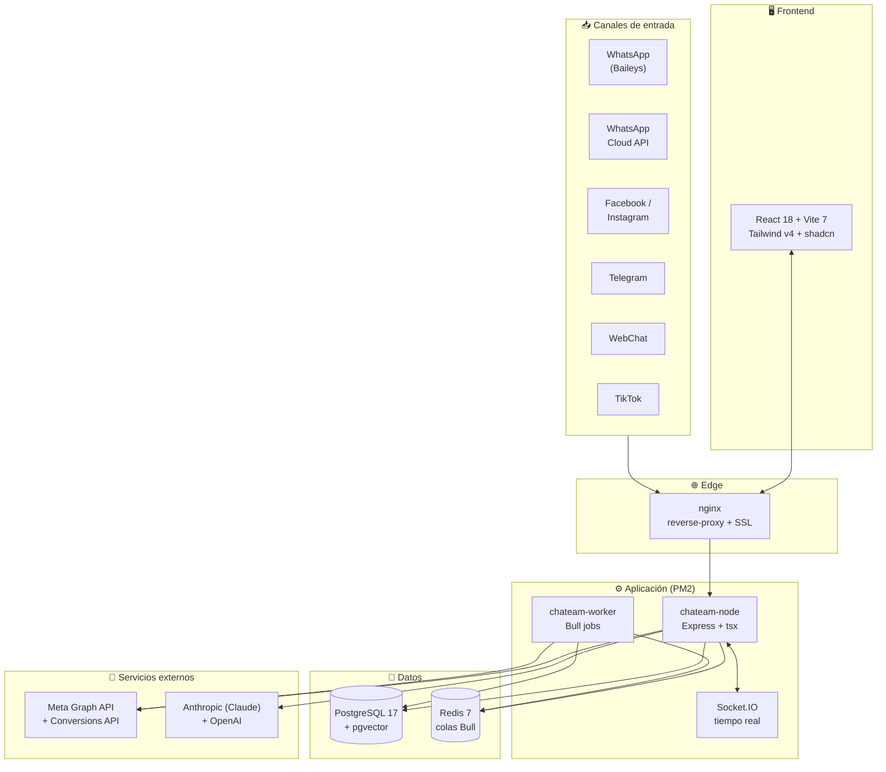
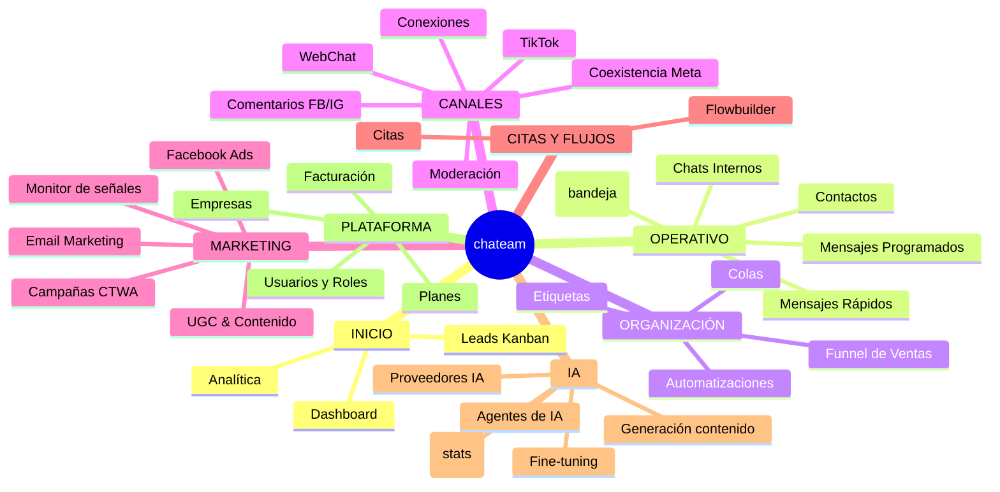
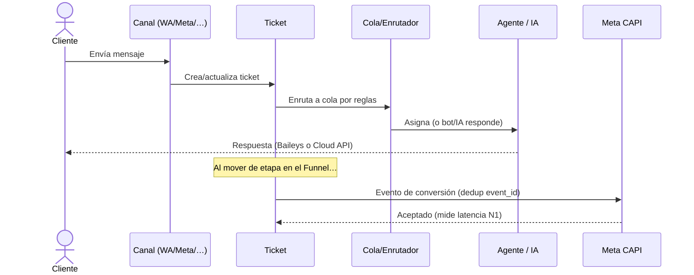
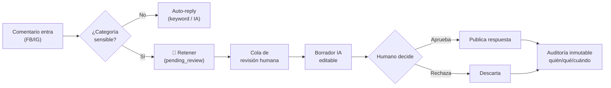

# chateam — Plataforma Omnicanal de Atención, Ventas y Marketing con IA

> Documento de referencia funcional y técnico. Describe qué es chateam y cada uno de
> sus módulos, agrupados como aparecen en la aplicación. Construido a partir del código
> real (166 pantallas, 122 grupos de servicios, 206 modelos, 133 ficheros de rutas).

---

## 1. Qué es chateam

**chateam** es un **CRM omnicanal multi-tenant** de la familia Whaticket, centrado en
**WhatsApp** pero unificando en una sola bandeja todos los canales de mensajería y
comentarios de una empresa, con una capa profunda de **Inteligencia Artificial** (Claude
y OpenAI) para atención asistida, generación de contenido, análisis y automatización de
marketing.

En una frase: **una bandeja única para conversar con clientes por cualquier canal, un
motor de IA que ayuda a responder y a crear contenido, y una suite de marketing que
conecta las conversaciones con la publicidad de Meta y mide el retorno real.**

**Para quién**: equipos de atención al cliente, ventas conversacionales, agencias de
marketing y negocios que operan campañas de anuncios *Click-to-WhatsApp*. Diseñado
como **SaaS multi-empresa**: cada empresa (tenant) tiene sus usuarios, roles, planes,
conexiones, datos y límites, aislados por `companyId`.

### Pilares del producto

1. **Bandeja omnicanal** — WhatsApp, Meta (Facebook/Instagram), Telegram, WebChat y
   comentarios de redes, todo en tickets unificados con asignación, colas y etiquetas.
2. **IA transversal** — respuestas asistidas, agentes conversacionales, generación de
   imagen/video/audio/texto, RAG sobre base de conocimiento, fine-tuning y observabilidad.
3. **Marketing de rendimiento** — campañas *Click-to-WhatsApp*, Meta Conversions API con
   deduplicación, ROAS real medido, monitor de calidad de señal (EMQ), portafolio creativo.
4. **Motor estadístico** — recomendaciones basadas en estadística real (no heurísticas):
   intervalos de confianza, bayesiano, regresión, Poisson, series de tiempo.
5. **Automatización operativa** — flujos, reglas, chatbots, funnel Kanban, calendario de
   aprobaciones, mensajes programados.

---

## 2. Arquitectura y stack

### Backend
- **Runtime**: Node.js + **TypeScript** ejecutado con **tsx** (ESM, sin build previo).
- **Framework**: **Express 4**.
- **ORM**: **Sequelize 6** + `sequelize-typescript` sobre **PostgreSQL 17** con **pgvector**
  (embeddings para RAG) y campos cifrados para secretos (tokens Meta, claves).
- **Colas y jobs**: **Redis 7** + **Bull** (workers y crons nocturnos/horarios).
- **Tiempo real**: **Socket.IO 4** (bandeja en vivo, badges, presencia).
- **Proceso**: **PM2** (fork) — procesos `chateam-node` (API) y `chateam-worker`.
- **Infra**: **Docker** (PostgreSQL, Redis), **nginx** como reverse-proxy + SSL.

### Frontend
- **React 18 + Vite 7**, **Tailwind CSS v4** (tokens por variables CSS, claro/oscuro),
  componentes estilo **shadcn** (`cva` + `clsx` + `tailwind-merge`, primitivos Radix),
  iconos **Phosphor**, tipografía **Poppins**.
- **Migración strangler**: convive con MUI Joy/Material durante la transición (Tailwind
  importado sin *preflight* para no resetear las pantallas heredadas).
- Rutas *lazy* (~158) con `ChunkErrorBoundary` que auto-recarga ante chunks obsoletos.

### IA
- **Anthropic (Claude)** + **OpenAI**, con **proveedores configurables por empresa**
  (claves cifradas en `AIProviderConfig`).
- **RAG** sobre pgvector, agentes, fine-tuning, generación multimodal.

### Multi-tenancy
- Aislamiento por **`companyId`** (170 de 206 modelos lo llevan). Política de
  **sesión única por usuario**. Roles y permisos por plan contratado.

### Diagrama de arquitectura

---

## 3. Canales soportados

| Canal | Tecnología | Notas |
|---|---|---|
| **WhatsApp (no oficial)** | Baileys | Sesiones QR, multi-dispositivo |
| **WhatsApp Cloud API** | Meta Graph API | Oficial; coexistencia con Baileys |
| **Facebook Messenger** | Meta Graph API | Mensajes y comentarios |
| **Instagram** | Meta Graph API | DM y comentarios |
| **Telegram** | Bot API | Sesiones de bot |
| **WebChat** | Widget propio + Socket.IO | Chat embebible en web |
| **TikTok** | TikTok API | Comentarios de posts |

El **enrutamiento de salida** es dinámico por ticket (elige Baileys vs Cloud API según
política y ventana de 24 h de Meta).

---

## 4. Módulos por sección

La aplicación organiza sus módulos en **10 secciones**. A continuación, cada sección con
sus módulos y qué hace cada uno.

### Mapa de módulos

### Ciclo de vida de una conversación

### Moderación de comentarios (Ola H)

### 4.1 INICIO
- **Gestión** — panel de acceso agregado a la operación.
- **Dashboard** — KPIs del negocio (usuarios, agentes online, conversaciones activas,
  mensajes del mes, reseñas) + gráficas SVG propias (actividad, distribución de tickets).
- **Leads Kanban** — conversión de leads en tablero, con envío de eventos a Meta por etapa.
- **Analítica** — métricas de atención y rendimiento.

### 4.2 OPERATIVO (la bandeja y su entorno)
- **Tickets** — **la bandeja omnicanal**, corazón del producto. Lista de conversaciones
  con avatar, canal, preview, no-leídos, etiquetas y colas; pestañas por estado
  (abiertos/pendientes/grupos/cerrados); filtros por canal, conexión, usuario, cola y
  fechas; búsqueda; ⌘K. La conversación abierta muestra estado, canal, política de
  enrutamiento de salida, indicador de ventana 24 h de Meta, asignación a campaña y
  origen. Sockets en vivo. Es la pantalla más rica del sistema.
- **Contactos** — CRM de contactos (nombre, número, canal, etiquetas, origen) con
  campos de **consentimiento de marketing** (LOPDP) y supresión.
- **Mensajes Rápidos** — respuestas predefinidas / atajos.
- **Chats Internos** — mensajería entre agentes del equipo.
- **Conversaciones Web** — bandeja específica del canal WebChat.
- **Mensajes Programados** — envíos diferidos y recurrentes.

### 4.3 ORGANIZACIÓN
- **Origen de Clientes** — trazabilidad del canal/campaña por el que llegó cada cliente.
- **Colas** — colas de atención (departamentos), con horarios, mensajes de saludo,
  chatbots, enrutador y opciones de menú.
- **Etiquetas** — sistema de tags; incluye **etiquetas Kanban** con configuración de
  seguimiento (follow-ups), IA por etapa y **conversión Meta por etapa** (evento,
  valor monetario, moneda, regla de deduplicación).
- **Automatizaciones** — motor de reglas sobre eventos de ticket.
- **Funnel de Ventas** — tablero Kanban de tickets con *drag & drop* por etapa,
  cabecera neutra con conteo; dispara eventos de conversión a Meta al mover tarjetas.
- **Dashboard Kanban** — métricas del funnel.

### 4.4 CANALES
- **Conexiones** — alta y gestión de las conexiones de cada canal (WhatsApp, Meta,
  Telegram, etc.), tokens y estado de sesión.
- **Coexistencia Meta** — flujo de convivencia Baileys ↔ WhatsApp Cloud API y migración.
- **Plantillas** — plantillas de mensaje de WhatsApp Cloud API.
- **Migrar a Meta** — asistente de migración de número a Cloud API.
- **TikTok Comments** — ingesta y respuesta de comentarios de TikTok.
- **Comentarios FB/IG** — módulo de comentarios de Facebook e Instagram:
  - **Bandeja** — feed de comentarios con auto-reply por keyword y por IA.
  - **Moderación** — **cola de revisión humana obligatoria** para comentarios sensibles
    (insultos, legal/electoral, denuncias, spam…): clasificación automática, borrador de
    respuesta editable, aprobar/rechazar con auditoría inmutable. **Cero publicación
    automática** en categorías sensibles (pensado para cuentas en campaña política).
  - **Configuración** — categorías sensibles y reglas.
- **WhatsApp API** (oculto por defecto) — Dashboard y Plantillas de la API oficial.
- **WebChat** — Configuración, Conversaciones, Analytics e Historial del widget web.

### 4.5 MARKETING & CAMPAÑAS
- **Campañas** — creación y gestión de campañas de mensajería (Lista, Contactos,
  Configuración) e **IA de Campañas** y **Reglas**.
- **UGC & Contenido** — producción de contenido generado por creadores:
  - **Dashboard**, **Campañas UGC**, **Elegir Modelos**, **Cinema Studio**,
    **Video Studio**, **Optimización IA**, **Posts Programados**.
  - Gestiona creadores (`UGCCreator`), asignaciones con **aprobación pieza-por-pieza**
    (aprobar/comentar/rechazar con plazo), pagos, variantes creativas y publicación social.
- **Marketing** (rendimiento publicitario Meta):
  - **Insights** — importación horaria de métricas de Meta a `InsightsDaily`
    (spend, CPM, CPC, CTR, frecuencia, conversaciones, coste/conversación).
  - **Atribución** — atribución de ventas a campañas (último toque + señales de click id).
  - **Auditoría** — registro auditable de llamadas a la API de Meta (persistente).
  - **Facebook Ads** — panel central de anuncios: eventos de conversión, leads Kanban y
    **Monitor de señales** (semáforo token/dataset/webhook/calidad del número +
    enviados/aceptados/rechazados por día + **EMQ real** de Meta).
- **Email Marketing** — Dashboard, Campañas, Analytics y Plantillas de correo.

**Motor de campañas Click-to-WhatsApp (CTWA)**: crear campaña completa (objetivo
engagement + CBO, adset broad con `destination_type=WHATSAPP`, anuncio) siempre en
**PAUSED**; portafolio creativo (subida a `/adimages`, carrusel, preview por ubicación,
copys AIDA); **graduación de ganadores** a campaña de escalado; **bloqueo de fase de
aprendizaje 72 h**; alerta de fatiga real (CTR↓ + CPA↑); **gating de aprobación mensual**
antes de lanzar.

### 4.6 CITAS Y FLUJOS
- **Citas** — agenda de citas (servicios, disponibilidad, reservas, recordatorios,
  sincronización con Google/Outlook Calendar). Al reservar, emite `Schedule` a Meta CAPI.
- **Flowbuilder** — constructor visual de flujos conversacionales / chatbots.

### 4.7 AFILIADOS
- **Afiliados** — programa de afiliados (referidos, comisiones), incluida una vertiente
  **Afiliados IA**.

### 4.8 INTELIGENCIA ARTIFICIAL
- **Plataforma IA**:
  - **Dashboard IA**, **Recomendaciones** (panel del motor estadístico), **Base de
    Conocimiento** (RAG), **Agentes de IA** (identidades y comportamiento).
- **Generación de Contenido**:
  - **AI Writer** (texto), **Generar Imágenes**, **Generar Videos**, **Audio IA**,
    **Multimodal**, **HeyGen Video**.
- **IA Avanzada**:
  - **Proveedores IA** (configurar OpenAI/Anthropic por empresa, claves cifradas + test),
    **A/B Testing**, **Observabilidad**, **Fine-tuning**, **Prompts**,
    **Paquetes de Créditos**, **Planes y Subscripciones**, **Afiliados IA**,
    **Revisión de Correcciones** (aprendizaje humano-en-el-bucle).
- **Costos IA**:
  - **Mi Consumo IA**, **Rentabilidad IA** — control de gasto y márgenes de IA.

**Motor estadístico** (recomendaciones basadas en estadística real, no heurísticas):
IC 95 % de CPA/ROAS, scoring bayesiano de leads (Beta-Binomial), demanda de chat
(Poisson), χ² de independencia, z-test A/B, cartas de control ±3σ, muestreo Thompson
para presupuesto, regresión OLS con p-valores, pronóstico Holt. Corre en un **job
nocturno** y persiste en `recommendation_runs` con método + probabilidad + supuesto,
midiendo la tasa de acierto. Regla de oro: **nunca reporta un número sin muestra mínima**
(marca "datos insuficientes" con el n que falta en vez de inventar).

### 4.9 CONFIGURACIÓN
- **Configuración General** — ajustes de la empresa (tickets, LGPD/privacidad, tema…).
- **Usuarios** — alta y gestión de usuarios del tenant.
- **Roles y Usuarios** — roles preestablecidos y configurables (super_admin, admin de
  empresa, supervisor, agente, marketing) con **matriz de permisos módulo-por-módulo** y
  control por el número de usuarios del plan contratado.
- **Integraciones de Cola** — integraciones externas ligadas a colas.
- **Conexiones** — credenciales de integraciones.
- **Facturación** — facturas y suscripción del tenant.
- **Permisos** — gestión fina de acceso.

### 4.10 PLATAFORMA (super-admin)
- **Administración**:
  - **Planes**, **Empresas** (gestión de todos los tenants), **Consumo de Tokens IA**,
    **Términos y Condiciones**, **API Mensajes**.
- **Desarrollo**:
  - **Logs**, **Herramientas Dev**.
- **Utilidades del usuario**: **Mi Perfil**, **Notificaciones**, **Ayuda**, **Feedback**.

---

## 5. Motores y capacidades transversales

### 5.1 Meta Conversions API (CAPI)
Envío server-side de eventos a Meta con **deduplicación por `event_id`**, hashing
**SHA-256** de PII, normalización de teléfono a **E.164**, soporte `business_messaging` +
`ctwa_clid` (atribución de anuncios Click-to-WhatsApp). Cliente con **token-bucket**
(Bottleneck) que lee la **cuota real** de Meta y frena proactivamente (corta al 100 %),
`appsecret_proof` verificado por app, y **no reintenta** bloqueos por políticas (368) ni
límites — evita agravar sanciones.

### 5.2 Motor de recomendaciones estadísticas
Ver §4.8. `StatisticsService` (matemática cerrada en TypeScript, sin sidecar) +
`StatsRecommendationService` (orquestador) + `recommendation_runs` (auditoría y acierto)
+ job nocturno + panel de Recomendaciones.

### 5.3 Colas, jobs y crons
Bull sobre Redis para envíos, verificaciones y procesos pesados. Crons de backend:
importación horaria de insights, motor estadístico nocturno, calendario mensual de
campañas (apertura/recordatorios/aprobación), recordatorios de citas, backups, etc.

### 5.4 RAG y agentes
Base de conocimiento vectorial (pgvector) + agentes con identidad, brand-prompt y
ejemplos de aprendizaje; usada por atención asistida, generación de copys y moderación.

### 5.5 Seguridad y cumplimiento
- **Multi-tenant estricto**: `companyId` siempre del token, nunca del query; override
  cross-empresa sólo para super.
- **RBAC**: roles y permisos por módulo y por plan.
- **LOPDP (Ecuador)**: consentimiento de marketing por contacto + **derecho de supresión**
  que purga la cola de eventos pendientes del titular.
- **Auditoría inmutable persistente** de llamadas a Meta y de las aprobaciones de
  moderación (quién/qué/cuándo).
- **Facturación electrónica** y recibos (según vertical).

---

## 6. Modelo de datos (visión general)

206 modelos, 170 con `companyId`. Familias principales:

- **Conversación**: `Ticket`, `Message`, `Contact`, `Queue`, `Tag`, `Whatsapp` (conexión),
  `TicketNote`, `QuickMessage`.
- **Marketing/Meta**: `Campaign`, `CampaignMessage`, `FacebookDataset`,
  `FacebookConversionEvent`, `InsightsDaily`, `AttributionConversion`, `CampaignAlert`,
  `CampaignApproval`, `MetaAuditLog`, `RecommendationRun`.
- **UGC**: `UGCCreator`, `UGCCreatorAssignment`, `UGCCampaign`, `UGCSocialPost`,
  `UGCPostComment`, `SensitiveCategory`, `CommentModerationAudit`.
- **IA**: `AIProviderConfig`, `AIEntity`, `AIAgentIdentity`, prompts, créditos y consumo.
- **Plataforma**: `Company`, `User`, `Role`, `Plan`, `CompaniesSettings`, `Invoice`,
  `Notification`.

---

## 7. Resumen ejecutivo

chateam es, en esencia, **tres productos integrados sobre una misma base multi-tenant**:

1. **Un CRM omnicanal** que centraliza la conversación con el cliente por todos los canales.
2. **Una plataforma de IA** que asiste la atención y genera contenido (texto, imagen,
   video, audio) con proveedores configurables por empresa.
3. **Una suite de marketing de rendimiento** que conecta esas conversaciones con la
   publicidad de Meta, mide el **ROAS real** y recomienda decisiones con **estadística
   formal**, no con reglas de dedo.

Todo ello con un principio constante de **honestidad en el dato**: cuando no hay evidencia
suficiente, el sistema lo dice ("datos insuficientes") en vez de inventar un número.
